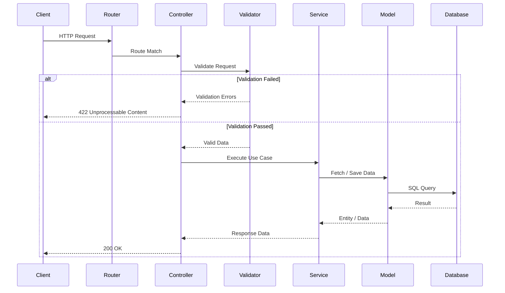
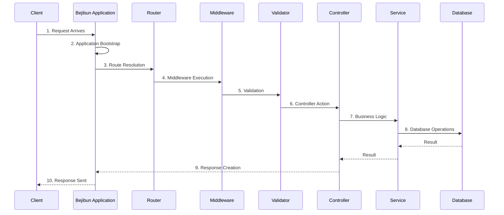
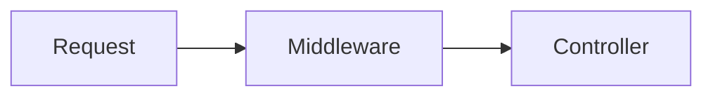
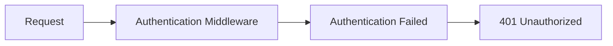

# Request Lifecycle

Understanding the request lifecycle is one of the most important concepts in Bejibun.

Every HTTP request follows a predictable path through the framework before a response is returned to the client.

By understanding this flow, you can:

- Debug applications more effectively
- Know where code should be placed
- Build maintainable architectures
- Understand framework internals
- Optimize application performance

This guide walks through the complete journey of a request.

---

# High-Level Overview

Every incoming request follows a sequence of steps:



Each layer has a specific responsibility.

---

# Lifecycle Overview

The complete lifecycle can be visualized as:




Let's examine each stage in detail.

### 1. Request Arrival

The lifecycle begins when a client sends an HTTP request.

Example:

```http
GET /users/1 HTTP/1.1
Host: example.com
```

The request may originate from:

- Web browsers
- Mobile applications
- Frontend frameworks
- External APIs
- Automated services

The Bejibun HTTP server receives the request and begins processing.

### 2. Application Bootstrap

Before handling requests, Bejibun initializes the application.

During bootstrap, the framework loads:

- Configuration
- Environment Variables
- Service Providers
- Framework Components
- Routes

Example:

```text
bootstrap.ts
```

This process prepares the application to handle requests efficiently.

In production environments, bootstrap operations are typically performed once when the application starts.

### 3. Route Resolution

After initialization, the router determines which route matches the request.

Example route:

```ts
Router.get("/users/:id", "UserController@show");
```

Incoming request:

```http
GET /users/1
```

Resolved parameters:

```json
{
    "id": 1
}
```

If no route matches:

```http
404 Not Found
```

is returned automatically.

### 4. Middleware Execution

Before reaching a controller, the request passes through middleware.

Middleware acts as a filtering layer.

Example:

```ts
Router.middleware(new AuthMiddleware()).get("/profile", "ProfileController@show");
```

Lifecycle:



Common middleware responsibilities include:

- Authentication
- Authorization
- Rate Limiting
- Logging
- Security Checks
- Request Transformation

Example:

```ts app/middlewares/AuthMiddleware.ts
import type {HandlerType} from "@bejibun/core/types";

export default class AuthMiddleware {
    public handle(handler: HandlerType): HandlerType {
        return async (request: Bun.BunRequest, server: Bun.Server<any>) => {
            // ...

            return handler(request, server);
        };
    }
}
```

If authentication fails, the request stops immediately.



The controller never executes.

### 5. Request Validation

After middleware completes, incoming data may be validated.

Example request:

```json
{
    "name": "John Doe",
    "email": "john@example.com"
}
```

Validator:

```ts app/validators/UserValidator.ts
import type {ValidatorType} from "@bejibun/core/types/ValidatorType";
import BaseValidator from "@bejibun/core/bases/BaseValidator";

export default class UserValidator extends BaseValidator {
    public static get store(): ValidatorType {
        return super.validator.create({
            name: super.validator.string(),
            email: super.validator.string().email()
        });
    }
}
```

Controller:

```ts app/controllers/UserController.ts
import UserValidator from "@/app/validators/UserValidator";

export default class UserController extends BaseController {
    // ...

    public async store(request: Bun.BunRequest): Promise<Response> {
        const body = await super.parse(request);
        await super.validate(UserValidator.store, body);

        const user = await UserModel.create({
            name: body.name,
            email: body.email
        });

        return super.response.setData(user).send();
    }

    // ...
}
```

If validation fails:

```json
{
  "errors": [
    {
      "field": "email",
      "message": "Invalid email"
    }
  ]
}
```

The request stops and a validation response is returned.

### 6. Controller Execution

If validation succeeds, the controller action executes.

Example:

```ts
export default class UserController {
  async show({ params }) {
    return User.findOrFail(
      params.id
    );
  }
}
```

Controllers serve as the entry point for application logic.

Responsibilities include:

- Handling requests
- Coordinating services
- Returning responses

Controllers should remain focused and concise.

### 7. Business Logic Layer

Complex operations should be delegated to services.

Instead of:

```ts
async store({ request }) {
  // hundreds of lines
}
```

Use:

```ts
async store({ request }) {
  return UserService.create(
    request.all()
  );
}
```

Service:

```ts
export default class UserService {
  static async create(data) {
    return User.create(data);
  }
}
```

Benefits:

- Reusability
- Maintainability
- Testability
- Separation of concerns

### 8. Database Operations

Most applications interact with a database.

Example:

```ts
const user =
  await User.findOrFail(id);
```

Lifecycle:

```text
Service
   │
   ▼
Model
   │
   ▼
Database Query
   │
   ▼
Result
```

Bejibun models abstract database interactions into TypeScript classes.

### 9. Response Generation

After processing is complete, a response is created.

Example:

```ts
return {
  message: "Success"
};
```

Generated response:

```json
{
  "message": "Success"
}
```

Responses may include:

- JSON
- Text
- Streams
- Files
- Redirects

---

## Explicit Responses

Example:

```ts
return response.ok({
  message: "User created"
});
```

Or:

```ts
return response.created({
  id: user.id
});
```

These helpers improve readability and consistency.

---

# 10. Response Sent

Finally, the response is returned to the client.

```text
Controller
     │
     ▼
Response
     │
     ▼
HTTP Server
     │
     ▼
Client
```

At this point, the request lifecycle is complete.

---

# Error Handling

Errors can occur at any stage.

Examples:

```text
Route Not Found
Validation Failure
Authentication Failure
Database Error
Application Error
```

Bejibun catches and formats errors consistently.

Example:

```json
{
  "message": "User not found"
}
```

Centralized error handling ensures predictable API behavior.

---

# Middleware Pipeline

Middleware execution follows a pipeline pattern.

Example:

```text
Request
   │
   ▼
Auth Middleware
   │
   ▼
Rate Limit Middleware
   │
   ▼
Logging Middleware
   │
   ▼
Controller
```

After the controller returns:

```text
Controller
   │
   ▼
Logging Middleware
   │
   ▼
Response
```

Middleware can run both before and after controller execution.

---

# Complete Example

Consider the following endpoint:

```ts
Router.post(
  "/users",
  "UserController@store"
);
```

Request:

```json
{
  "name": "John",
  "email": "john@example.com"
}
```

Lifecycle:

```text
Request Arrives
      │
      ▼
Route Match
      │
      ▼
Authentication Middleware
      │
      ▼
Validation
      │
      ▼
Controller
      │
      ▼
UserService
      │
      ▼
User Model
      │
      ▼
Database Insert
      │
      ▼
JSON Response
      │
      ▼
Client
```

This represents the typical flow of most Bejibun applications.

---

# Lifecycle Best Practices

When building applications:

### Keep Controllers Thin

Good:

```ts
return UserService.create(
  payload
);
```

Avoid:

```ts
// massive controller logic
```

---

### Validate Early

Validate input before business logic executes.

---

### Use Middleware Appropriately

Middleware should handle cross-cutting concerns such as:

- Authentication
- Logging
- Security

---

### Centralize Business Logic

Place business rules in services rather than controllers.

---

### Handle Errors Consistently

Use framework-provided error handling whenever possible.

---

# Visual Summary

```text
┌──────────────┐
│   Client     │
└──────┬───────┘
       │
       ▼
┌──────────────┐
│    Router    │
└──────┬───────┘
       │
       ▼
┌──────────────┐
│ Middleware   │
└──────┬───────┘
       │
       ▼
┌──────────────┐
│ Validation   │
└──────┬───────┘
       │
       ▼
┌──────────────┐
│ Controller   │
└──────┬───────┘
       │
       ▼
┌──────────────┐
│  Services    │
└──────┬───────┘
       │
       ▼
┌──────────────┐
│ Models / DB  │
└──────┬───────┘
       │
       ▼
┌──────────────┐
│  Response    │
└──────────────┘
```

---

# What's Next?

You now understand how requests flow through a Bejibun application and how the framework's components work together.

The next section dives deeper into individual framework features such as:

- Routing
- Controllers
- Middleware
- Validation
- Database
- Authentication
- Caching
- Queues

With the request lifecycle understood, you'll be able to see exactly where each framework component fits into the
application architecture.