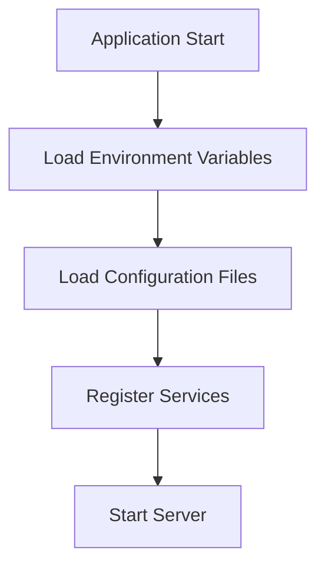
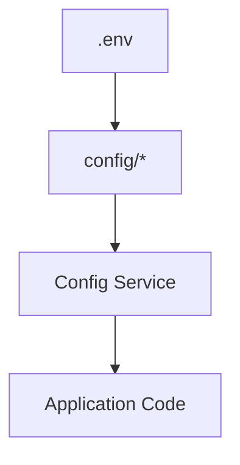

# Configuration

Configuration is the central place where application behavior is defined.

Rather than hardcoding values throughout your codebase, Bejibun encourages storing settings in dedicated configuration
 files and environment variables.

This approach provides:

- Cleaner code
- Easier maintenance
- Environment-specific settings
- Improved security
- Better deployment workflows

---

# Configuration Philosophy

Bejibun follows a simple principle:

> Configuration belongs in configuration files. Secrets belong in environment variables.

Application code should focus on business logic, not infrastructure settings.

Good:

```ts
const host = config("database.host");
```

Avoid:

```ts
const host = "127.0.0.1";
```

Centralized configuration makes applications easier to manage and scale.

---

# Configuration Directory

All framework and application configuration files are located in:

```text
config/
```

A typical configuration structure may look like:

```text
config/
├── cache.ts
├── command.ts
├── cors.ts
├── database.ts
├── disk.ts
├── limiter.ts
├── performance.ts
├── redis.ts
├── route.ts
├── websocket.ts
└── x402.ts
```

Each configuration file is responsible for a specific subsystem.

---

# How Configuration Works

Configuration files export objects that define application behavior.

Example:

```ts
const config: Record<string, any> = {
    port: 3000,
    host: "0.0.0.0"
};

export default config;
```

The framework loads configuration during startup and makes it available throughout the application.


---

# Accessing Configuration

Configuration values can be retrieved using the configuration service.

Example:

```ts
config("app.name");
```

Nested values can be accessed using dot notation.

```ts
config("database.default");

config("redis.host");

config("cache.driver");
```

This keeps configuration access consistent across the application.

---

# Environment-Aware Configuration

Most configuration values should come from environment variables.

Example:

```ts
const config: Record<string, any> = {
    host: env("DB_HOST"),
    port: env("DB_PORT")
};

export default config;
```

This allows different environments to use different settings without modifying application code.

Example:

```env
DB_HOST=localhost
```

Production:

```env
DB_HOST=database.internal
```

The application code remains unchanged.

---

# Cache Configuration

Configures cache drivers and cache behavior.

Cache settings are located in:

```text
config/cache.ts
```

Example:

```ts config/cache.ts
import App from "@bejibun/app";
import CacheDriverEnum from "@bejibun/cache/enums/CacheDriverEnum";

const config: Record<string, any> = {
    default: "local",

    connections: {
        local: {
            driver: CacheDriverEnum.Local,
            path: App.Path.storagePath("cache") // absolute path
        },

        redis: {
            driver: CacheDriverEnum.Redis,
            host: Bun.env.REDIS_HOST,
            port: Bun.env.REDIS_PORT,
            password: Bun.env.REDIS_PASSWORD,
            database: Bun.env.REDIS_DATABASE
        }
    }
};

export default config;
```

Common options:

- File
- Redis

Caching behavior can be adjusted without changing application code.

---

# Command Configuration

Configure the locations of your command directories.

CLI-related settings are stored in:

```text
config/command.ts
```

Example:

```ts config/command.ts
const config: Array<Record<string, any>> = [
    /*
    {
        path: "your-dependencies/your-directory-commands",
        path: "@bejibun/database/commands" // Example
    }
    */
];

export default config;
```

These settings may control:

- Command discovery
- Command registration
- Development tooling

---

# CORS Configuration

Controls cross-origin resource sharing behavior.

Cross-Origin Resource Sharing is configured in:

```text
config/cors.ts
```

Example:

```ts config/cors.ts
const config: Record<string, any> = {
    allowedHeaders: "*",
    credentials: false,
    exposedHeaders: [],
    maxAge: 86400,
    methods: "*",
    origin: "*"
};

export default config;
```

Common settings:

- Allowed headers
- Credentials support
- Exposed headers
- Max age cache
- Allowed methods
- Allowed origins

Proper CORS configuration is essential for browser-based applications.

---

# Database Configuration

Defines database connections and ORM behavior.

Database settings are typically stored in:

```text
config/database.ts
```

Example:

```ts config/database.ts
import type {Knex} from "knex";

const config: Knex.Config = {
    client: "pg",
    connection: {
        host: Bun.env.DB_HOST,
        port: Bun.env.DB_PORT,
        user: Bun.env.DB_USER,
        password: Bun.env.DB_PASSWORD,
        database: Bun.env.DB_DATABASE
    },
    migrations: {
        extension: "ts",
        directory: "./database/migrations",
        schemaName: "public",
        tableName: "migrations"
    },
    pool: {
        min: 0,
        max: 10
    },
    seeds: {
        extension: "ts",
        directory: "./database/seeders"
    }
};

export default config;
```

Common settings include:

- Connection driver
- Host
- Port
- Database name
- Username
- Password

---

# Disk Configuration

Configure disk connections and storage drivers.

Disk settings are stored in:

```text
config/disk.ts
```

Example:

```ts config/disk.ts
import App from "@bejibun/app";
import DiskDriverEnum from "@bejibun/core/enums/DiskDriverEnum";

const config: Record<string, any> = {
    default: "local",

    disks: {
        local: {
            driver: DiskDriverEnum.Local,
            root: App.Path.storagePath("app")
        },

        public: {
            driver: DiskDriverEnum.Local,
            root: App.Path.storagePath("app/public"),
            url: `${Bun.env.APP_URL}/storage/public`
        },

        s3: {
            driver: DiskDriverEnum.S3,
            endpoint: Bun.env.S3_ENDPOINT,
            region: Bun.env.S3_REGION,
            bucket: Bun.env.S3_BUCKET,
            access_key_id: Bun.env.S3_ACCESS_KEY_ID,
            secret_access_key: Bun.env.S3_SECRET_ACCESS_KEY,
            url: ""
        }
    }
};

export default config;
```

Common settings include:

- Default disk
- Local storage
- Public storage
- S3 storage support
- Environment variables support
- File storage configuration in one place

---

# Rate Limiter Configuration

Defines request throttling and rate-limiting rules.

Rate limiting settings are located in:

```text
config/limiter.ts
```

Example:

```ts config/limiter.ts
const config: Record<string, any> = {
    limit: 30,
    duration: 60 // seconds
};

export default config;
```

These settings help protect applications from abuse and excessive traffic.

---

# Performance Configuration

Configure performance-related features and settings.

Performance-related settings may be located in:

```text
config/performance.ts
```

Example:

```ts config/performance.ts
const config: Record<string, any> = {
    middlewares: {
        limiter: true,
        maintenance: true
    }
};

export default config;
```

Examples include:

- Rate limiting
- Maintenance mode
- Middleware controls

These settings help optimize application performance.

---

# Redis Configuration

Defines Redis connection settings.

Redis settings are stored in:

```text
config/redis.ts
```

Example:

```ts config/redis.ts
const config: Record<string, any> = {
    default: Bun.env.REDIS_CONNECTION,

    connections: {
        local: {
            host: Bun.env.REDIS_HOST,
            port: Bun.env.REDIS_PORT,
            password: Bun.env.REDIS_PASSWORD,
            database: Bun.env.REDIS_DATABASE,
            maxRetries: Number(Bun.env.REDIS_MAX_RETRIES)
        }
    }
};

export default config;
```

Redis may be used for:

- Cache
- Queues
- Rate limiting
- Realtime features

---

# Route Configuration

Configure Swagger/OpenAPI documentation settings.

Route settings are stored in:

```text
config/route.ts
```

Example:

```ts config/route.ts
const config: Record<string, any> = {
    default: "swagger",

    templates: {
        swagger: {
            openapi: "3.0.0",
            components: {
                securitySchemes: {
                    ApiKeyAuth: {
                        type: "apiKey",
                        in: "header",
                        name: "x-api-key"
                    },
                    BearerAuth: {
                        type: "http",
                        scheme: "bearer"
                    }
                }
            },
            security: [
                {
                    ApiKeyAuth: []
                },
                {
                    BearerAuth: []
                }
            ],
            tags: [
                {
                    name: "Hello",
                    description: "Dummy APIs"
                },
                {
                    name: "Test",
                    description: "Example APIs"
                }
            ],
            info: {
                title: "Route List",
                description: "Bejibun Route List",
                contact: {
                    name: "API Support",
                    email: "havea@bejibun.com",
                    url: "https://bejibun.com"
                },
                license: {
                    name: "MIT",
                    url: "https://github.com/Bejibun-Framework/bejibun/blob/master/LICENSE"
                }
            },
            servers: [
                {
                    url: Bun.env.APP_URL,
                    description: `${Bun.env.APP_ENV} server`
                }
            ],
            paths: {}
        }
    }
};

export default config;
```

Possible settings may include:

- Default API documentation (Swagger/OpenAPI)
- Authentication schemes (API key, Bearer token)
- API tags and grouping
- Server configuration (base URL, environment)
- Middleware applied to routes

---

# WebSocket Configuration

Configures realtime communication settings.

Realtime communication settings are stored in:

```text
config/websocket.ts
```

Example:

```ts config/websocket.ts
const config: Record<string, any> = {
    maxPayloadLength: 1024 * 1024 * 16,

    backpressureLimit: 1024 * 1024 * 16,

    closeOnBackpressureLimit: false,

    idleTimeout: 60,

    publishToSelf: false,

    sendPings: false
};

export default config;
```

Possible configuration includes:

- Message size limits
- Connection timeout
- Backpressure handling
- Ping/pong behavior
- Self-message handling
- Channel behavior
- Scaling settings

---

# x402 Configuration

Configure x402 payment settings.

x402 settings are stored in:

```text
config/x402.ts
```

Example:

```ts config/x402.ts
const config = {
    version: 1,
    network: "solana-devnet",
    address: "GAnoyvy9p3QFyxikWDh9hA3fmSk2uiPLNWyQ579cckMn",
    price: "$0.01",
    timeout: 60,
    forceJson: false,
    testnet: true
};
export default config;
```

Depending on your application, this configuration may define:

- Payment providers
- Pricing
- Monetized endpoints
- Payment verification

---

# Creating Custom Configuration

Applications can create their own configuration files.

Example:

```text
config/services.ts
```

```ts config/services.ts
const config = {
    stripe: {
        key: env("STRIPE_KEY")
    }
};
export default config;
```

Access it anywhere:

```ts
config("services.stripe.key");
```

Custom configuration keeps application settings organized.

---

# Organizing Configuration

As your application grows, group configuration by responsibility.

Good:

```text
config/
├── cache.ts
├── command.ts
├── cors.ts
├── database.ts
├── disk.ts
├── limiter.ts
├── performance.ts
├── redis.ts
├── route.ts
├── websocket.ts
└── x402.ts
```

Avoid placing unrelated settings into a single large configuration file.

---

# Configuration vs Environment Variables

A common question is where settings should live.

### Use Configuration Files For

- Application Behavior
- Framework Settings
- Feature Flags
- Default Values
- Driver Selection

### Use Environment Variables For

- Passwords
- API Keys
- Secrets
- Tokens
- Environment-Specific Values

Rule of thumb:

> If a value changes between environments, it probably belongs in an environment variable.

---

# Example Workflow

A database connection usually follows this pattern:

### Environment Variable

```env
DB_HOST=127.0.0.1
```

### Configuration File

```ts
host: env("DB_HOST")
```

### Application Code

```ts
Database.connect();
```

Application code never needs to know where the value originates.

---

# Best Practices

### Keep Secrets Out of Source Code

Good:

```env
DB_PASSWORD=secret
```

Avoid:

```ts
password: "secret"
```

### Use Environment Variables

Store deployment-specific values in `.env`.

### Group Related Settings

Organize configuration by subsystem.

### Use Meaningful Names

Good:

```ts
payment.defaultProvider
```

Avoid:

```ts
provider
```

### Avoid Direct Environment Access

Prefer:

```ts
config("database.host");
```

instead of:

```ts
env("DB_HOST");
```

throughout application code.

This keeps configuration centralized.

---

# Configuration Loading Lifecycle

During startup, Bejibun loads configuration before serving requests.



This ensures all services receive the correct configuration before handling requests.

---

# Visual Summary



This separation keeps applications flexible, maintainable, and secure.

---

# What's Next?

Now that you understand how configuration works, continue with:

- Environment Variables
- Deployment Overview
- Request Lifecycle

These guides explain how environment values are loaded, how requests flow through the framework, and how services are resolved throughout the application.