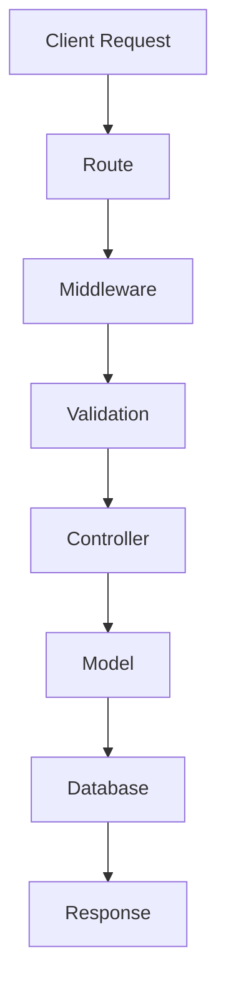

# Creating Your First Application

Now that Bejibun is installed, it's time to build your first application.

In this guide, you'll create a simple User Management API while learning the framework's core concepts:

- Routing
- Controllers
- Request Handling
- Validation
- Models
- Database Operations

By the end of this guide, you'll understand how a typical Bejibun application is structured and how its components work together.

---

# What We Are Building

We'll create a small API that allows users to:

| Method | Endpoint   | Description       |
| ------ | ---------- | ----------------- |
| GET    | /users     | Get all users     |
| GET    | /users/:id | Get user by ID    |
| POST   | /users     | Create new user   |
| PUT    | /users/:id | Update user by ID |
| DELETE | /users/:id | Delete user by ID |

Example response:

```json
{
    "id": 1,
    "name": "John Doe",
    "email": "john@example.com"
}
```

Although simple, this application demonstrates the most common patterns you'll use in real-world projects.

---

# Step 1: Create a New Project

If you haven't already created a project:

```bash
bunx @bejibun/cli my-app
```

Navigate into the project:

```bash
cd my-app
```

Start the development server:

```bash
bun dev
```

---

# Step 2: Generate a User Model

Models represent database tables.

Generate a model:

```bash
bun ace make:model User
```

Generated file:

```text
app/models/UserModel.ts
```

Example:

```ts app/models/UserModel.ts
import type {Timestamp, NullableTimestamp} from "@bejibun/core/bases/BaseModel";
import BaseModel from "@bejibun/core/bases/BaseModel";

export default class UserModel extends BaseModel {
    public static tableName: string = "users";
    public static idColumn: string = "id";

    declare id: bigint;
    declare name: string;
    declare email: string;
    declare created_at: Timestamp;
    declare updated_at: Timestamp;
    declare deleted_at: NullableTimestamp;
}
```

The model provides an object-oriented interface for interacting with database records.

---

# Step 3: Create a Migration

Database tables are managed through migrations.

Generate a migration:

```bash
bun ace make:migration create_users_table
```

Example migration:

```ts database/migrations/20260101_000001_create_users_table.ts
import type {Knex} from "knex";
import UserModel from "@/app/models/UserModel";

export function up(knex: Knex): Knex.SchemaBuilder {
    return knex.schema.createTable(UserModel.tableName, (table: Knex.TableBuilder) => {
        table.bigIncrements("id");
        table.string("name");
        table.string("email").unique();
        table.timestamps(true, true);
        table.timestamp("deleted_at");
    });
}

export function down(knex: Knex): Knex.SchemaBuilder {
    return knex.schema.dropTable(UserModel.tableName);
}
```

Run the migration:

```bash
bun ace migrate:latest
```

This creates the `users` table in your database.

---

# Step 4: Generate a Controller

Controllers contain your application's request handling logic.

Generate a controller:

```bash
bun ace make:controller User
```

Generated file:

```text
app/controllers/UserController.ts
```

Example:

```ts app/controllers/UserController.ts
import BaseController from "@bejibun/core/bases/BaseController";

export default class UserController extends BaseController {
    //
}
```

We'll implement functionality shortly.

---

# Step 5: Register Routes

Open your routes file:

```text
routes/api.ts
```

Register user routes:

```ts
Router.prefix("users").group([
    Router.get("/", "UserController@index"),

    Router.get("/:id", "UserController@show"),

    Router.post("/", "UserController@store"),

    Router.put("/:id", "UserController@update"),

    Router.delete("/:id", "UserController@destroy")
]);
```

Each route maps an HTTP request to a controller action.

---

# Step 6: Implement the Controller

Let's add the controller methods.

```ts app/controllers/UserController.ts
import BaseController from "@bejibun/core/bases/BaseController";

export default class UserController extends BaseController {
    public async index(request: Bun.BunRequest): Promise<Response> {
        const users = await UserModel.all();

        return super.response.setData(users).send();
    }

    public async show(request: Bun.BunRequest): Promise<Response> {
        const body = await super.parse(request);

        const user = await UserModel.findOrFail(body.id);

        return super.response.setData(user).send();
    }

    public async store(request: Bun.BunRequest): Promise<Response> {
        const body = await super.parse(request);

        const user = await UserModel.create({
            name: body.name,
            email: body.email
        });

        return super.response.setData(user).send();
    }

    public async update(request: Bun.BunRequest): Promise<Response> {
        const body = await super.parse(request);

        const user = await UserModel.findOrFail(body.id).update({
            name: body.name,
            email: body.email
        });

        return super.response.setData(user).send();
    }

    public async destroy(request: Bun.BunRequest): Promise<Response> {
        const body = await super.parse(request);

        await UserModel.findOrFail(body.id).delete();

        return super.response.setData().send();
    }
}
```

This controller provides complete CRUD functionality.

---

# Step 7: Add Validation

Accepting user input without validation is dangerous.

Generate a validator:

```bash
bun ace make:validator User
```

Example:

```ts app/validators/UserValidator.ts
import type {ValidatorType} from "@bejibun/core/types/ValidatorType";
import BaseValidator from "@bejibun/core/bases/BaseValidator";

export default class UserValidator extends BaseValidator {
    public static get store(): ValidatorType {
        return super.validator.create({
            name: super.validator.string(),
            email: super.validator.string().email()
        });
    }
}
```

Use the validator:

```ts
import UserValidator from "@/app/validators/UserValidator";

export default class UserController extends BaseController {
    // ...

    public async store(request: Bun.BunRequest): Promise<Response> {
        const body = await super.parse(request);
        await super.validate(UserValidator.store, body);

        const user = await UserModel.create({
            name: body.name,
            email: body.email
        });

        return super.response.setData(user).send();
    }

    // ...
}
```

Now incoming data is validated before reaching your business logic.

---

# Step 8: Test the API

Create a user:

```http
POST /users
```

Request body:

```json
{
    "name": "John Doe",
    "email": "john@example.com"
}
```

Response:

```json
{
    "data": {
        "id": 1,
        "name": "John Doe",
        "email": "john@example.com",
        "created_at": "2026-01-01T15:00:000Z",
        "updated_at": "2026-01-01T15:00:000Z"
    },
    "message": "Success",
    "status": 200
}
```

Retrieve users:

```http
GET /users
```

Response:

```json
{
    "data": [
        {
            "id": 1,
            "name": "John Doe",
            "email": "john@example.com",
            "created_at": "2026-01-01T15:00:000Z",
            "updated_at": "2026-01-01T15:00:000Z"
        }
    ],
    "message": "Success",
    "status": 200
}
```

Retrieve a specific user:

```http
GET /users/1
```

Response:

```json
{
    "data": {
        "id": 1,
        "name": "John Doe",
        "email": "john@example.com",
        "created_at": "2026-01-01T15:00:000Z",
        "updated_at": "2026-01-01T15:00:000Z"
    },
    "message": "Success",
    "status": 200
}
```

---

# Understanding the Request Flow

When a request reaches your application, it passes through several layers.



Understanding this flow is critical for building maintainable applications.

---

# Organizing Business Logic

As applications grow, controllers should remain thin.

Avoid:

```ts
public async store(request: Bun.BunRequest): Promise<Response> {
    // hundreds of lines of logic
}
```

Instead:

```ts
public async store(request: Bun.BunRequest): Promise<Response> {
    const body = await super.parse(request);

    return super.response.setData(
        UserService.create(body)
    ).send();
}
```

Example service:

```ts app/services/UserService.ts
export default class UserService {
    public static async create(data) {
        return User.create(data);
    }
}
```

This improves maintainability and testability.

---

# Error Handling

Database lookups may fail.

Example:

```ts
await User.findOrFail(999);
```

If the user does not exist, Bejibun automatically returns an appropriate error response.

Example:

```json
{
    "data": null,
    "message": "No query results for model [UserModel] [999].",
    "status": 404
}
```

Framework-provided error handling helps maintain consistency across applications.

---

# Using Resource Controllers

For standard CRUD endpoints, Bejibun may provide resource routing.

Instead of:

```ts
Router.get("/users", "UserController@index");

Router.get("/users/:id", "UserController@show");

Router.post("/users", "UserController@store");

Router.put("/users/:id", "UserController@update");

Router.delete("/users/:id", "UserController@destroy");
```

You can use:

```ts
Router.resource("users", UserController);
```

This generates a complete set of conventional CRUD routes automatically.

---

# What You Have Learned

In this guide, you:

- Created a Bejibun project
- Generated a model
- Created a migration
- Built a controller
- Registered routes
- Added validation
- Performed database operations
- Tested an API endpoint

These concepts form the foundation of most Bejibun applications.

---

# Common Next Steps

After completing this tutorial, developers typically move on to:

- Authentication
- Authorization
- Relationships
- File Uploads
- Caching
- Background Jobs
- API Documentation

Each of these topics builds upon the concepts introduced here.

---

# Next Steps

Continue to:

- Project Structure
- Configuration
- Environment Variables

In the next chapter, you'll explore how a Bejibun application is organized and learn the purpose of each directory within a project.