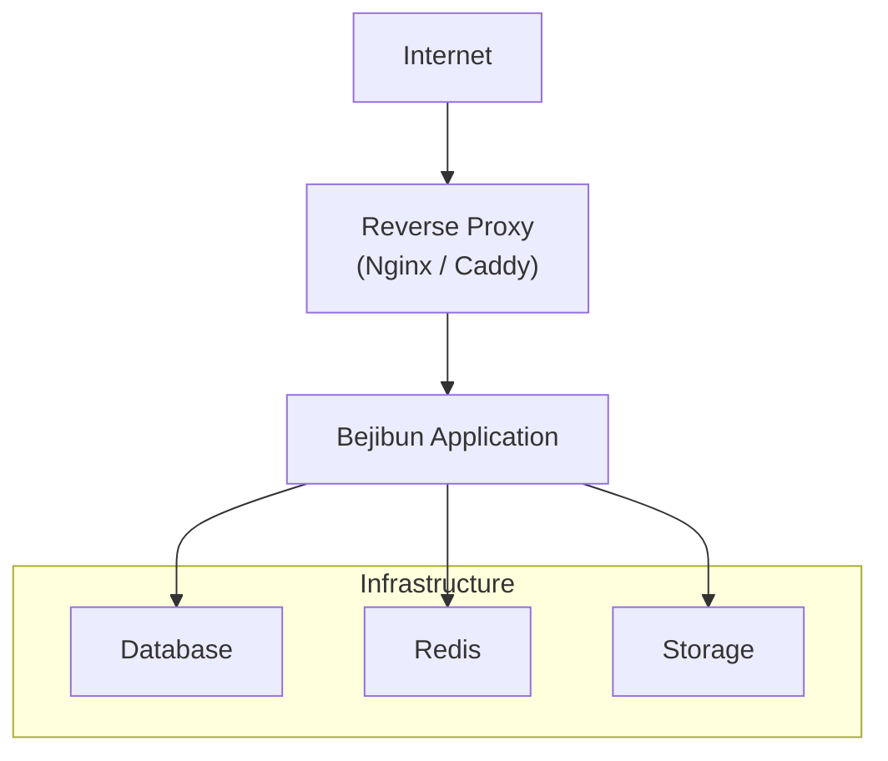
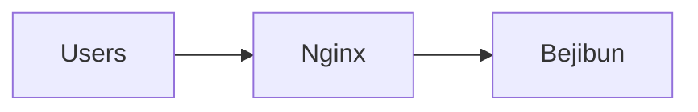
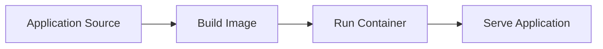
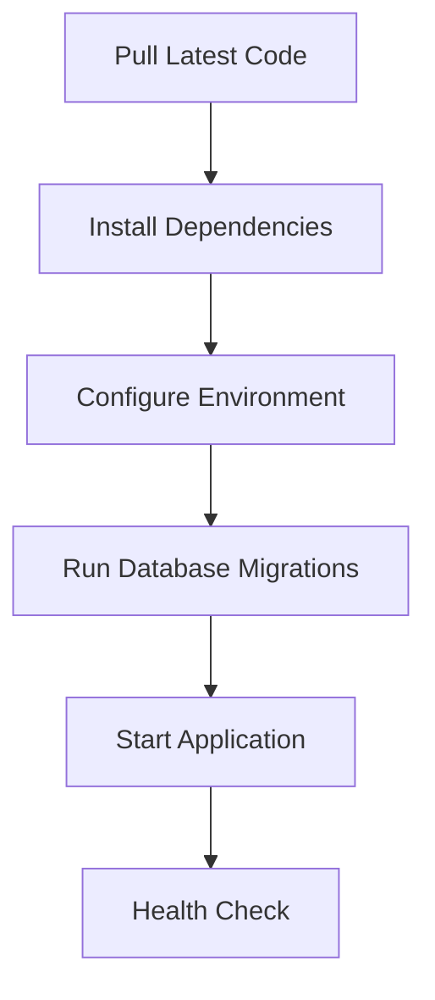
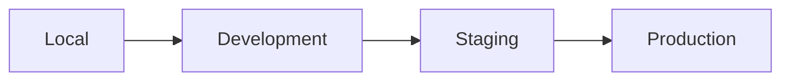
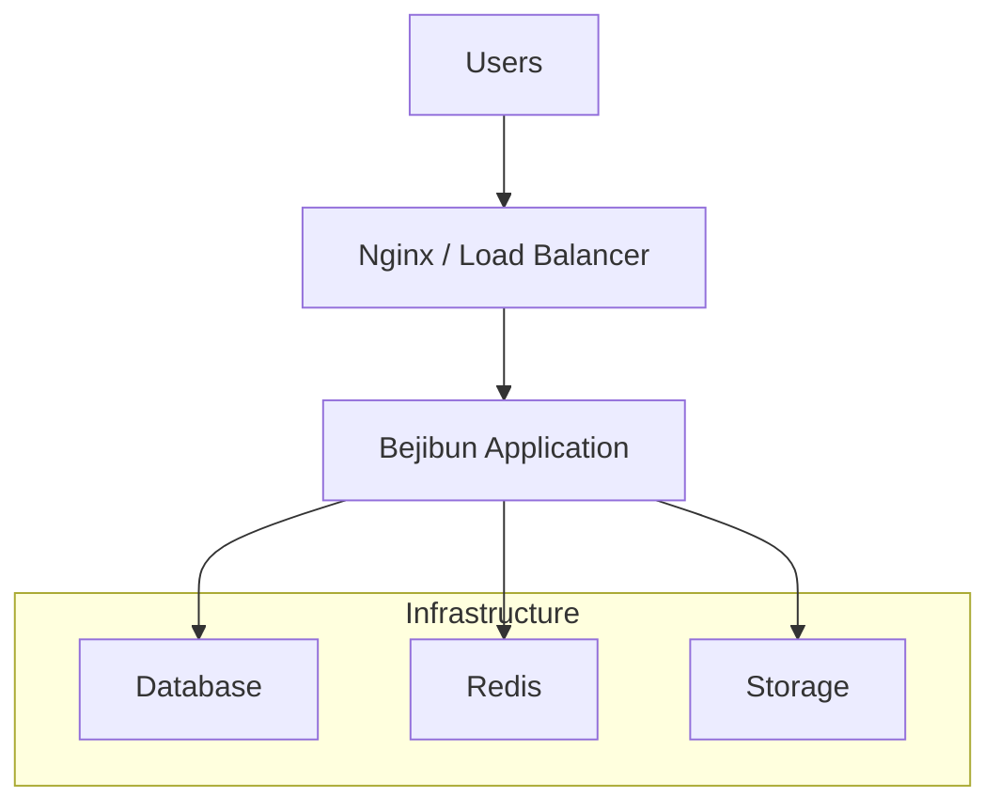

# Deployment Overview

Deploying a Bejibun application involves more than simply running the application on a server. A production environment
must be configured to provide reliability, security, scalability, and operational visibility.

Bejibun applications run on the Bun runtime and can be deployed to:

- Virtual Private Servers (VPS)
- Dedicated Servers
- Docker Containers
- Cloud Platforms
- Kubernetes Clusters

Regardless of the deployment strategy, the core deployment process remains the same.

---

## Production Architecture

A typical production environment consists of several services working together.



Depending on your application requirements, Redis and external storage providers may be optional.

---

## Deployment Requirements

Before deploying a Bejibun application, ensure your environment provides:

### Required

- Bun Runtime
- Database
- Environment Configuration
- Writable Storage Directories

### Optional

- Redis
- Amazon S3
- Cloudflare R2
- Monitoring Services
- Load Balancers

---

## Environment Configuration

Production configuration should be managed through environment variables.

Example:

```env
APP_NAME=Bejibun
APP_ENV=production
APP_HOST=127.0.0.1
APP_PORT=3000
APP_URL="http://${APP_HOST}:${APP_PORT}"

DB_HOST=127.0.0.1
DB_PORT=5432
DB_USER=root
DB_PASSWORD=root
DB_DATABASE=app
```

Never commit production credentials into source control.

Environment variables allow applications to be configured differently across development, staging, and production environments.

---

## Database Setup

Most Bejibun applications use PostgreSQL as their primary database.

Before serving production traffic:

1. Create the production database
2. Configure database credentials
3. Verify connectivity
4. Run migrations

```bash
bun ace migrate:latest
```

Migrations should always be executed before deploying new application versions that introduce schema changes.

---

## Running Seeders

Some applications require default data to exist before startup.

Examples include:

- Roles
- Permissions
- System Settings
- Reference Data

Seeders can be executed with:

```bash
bun ace db:seed
```

Only run seeders when required by your application.

---

## Storage Configuration

Bejibun provides a storage abstraction layer that supports multiple storage drivers.

Configuration is defined in:

```text
config/disk.ts
```

Available storage options may include:

- Local Storage
- Public Storage
- Amazon S3
- S3-Compatible Providers

Applications should ensure storage locations are writable and persistent.

---

## User Uploads

Applications that handle file uploads should carefully plan storage strategy.

Examples:

- Profile Images
- Documents
- Product Images
- Reports

Avoid storing user uploads inside temporary deployment directories.

For production systems, external object storage is often recommended.

---

## Cloud Storage

Cloud storage providers improve scalability and reliability.

Common choices include:

- Amazon S3
- Cloudflare R2
- MinIO
- Google Cloud Storage

Benefits include:

- High durability
- Automatic redundancy
- Global availability
- Reduced server disk usage

---

## Redis Integration

Redis can be used to support framework features such as:

- Cache
- Queues
- Sessions
- Rate Limiting

When enabled, Redis credentials should be configured through environment variables.

Example:

```env
REDIS_HOST=127.0.0.1
REDIS_PORT=6379
REDIS_PASSWORD=
REDIS_DATABASE=0
REDIS_MAX_RETRIES=10
REDIS_CONNECTION=local
```

---

## Installing Dependencies

Install project dependencies before starting the application.

```bash
bun install
```

Production deployments should install only the dependencies required to run the application.

---

## Starting The Application

Once configured, start the application using:

```bash
bun start
```

For local development:

```bash
bun dev
```

Production environments should always use the production startup command.

---

## Process Management

Applications should run under a process manager to ensure reliability.

Common options include:

- systemd
- PM2
- Docker
- Kubernetes

Benefits include:

- Automatic restarts
- Crash recovery
- Log management
- Process monitoring

---

## Reverse Proxy

A reverse proxy should be placed in front of the application.

Common choices:

- Nginx
- Caddy
- Traefik

Responsibilities include:

- HTTPS termination
- Request forwarding
- Compression
- Caching
- Load balancing

Example architecture:



---

## HTTPS

All production deployments should use HTTPS.

Benefits include:

- Encrypted traffic
- Improved security
- Browser trust
- Better SEO

Certificates can be provided through:

- Let's Encrypt
- Cloud Providers
- Commercial Certificate Authorities

---

## Docker Deployments

Bejibun includes Docker support for containerized deployments.

Typical workflow:



Containers provide consistent deployment behavior across environments.

---

## Deployment Workflow

A typical deployment process looks like:



Automating this workflow helps reduce deployment errors.

---

## Zero-Downtime Deployments

Production systems should minimize service interruptions during releases.

Common deployment strategies include:

- Blue-Green Deployments
- Rolling Deployments
- Container Replacements

These approaches allow new versions to be released with little or no downtime.

---

## Health Checks

Health checks allow infrastructure and monitoring systems to determine whether the application is operating correctly.

Health checks typically verify:

- Application Status
- Database Connectivity
- Redis Connectivity
- Service Availability

Reliable health checks improve operational visibility.

---

## Logging

Production environments should collect and retain logs.

Important log sources include:

- Application Logs
- Error Logs
- Access Logs

Logs are essential for troubleshooting and incident investigation.

---

## Monitoring

Monitoring provides visibility into system health and performance.

Typical metrics include:

- CPU Usage
- Memory Usage
- Response Time
- Database Performance
- Error Rates

Production applications should always be monitored.

---

## Backups

Backups are critical for disaster recovery.

Important backup targets include:

- Databases
- Uploaded Files
- Configuration Data

Backups should be tested regularly to ensure they can be restored successfully.

---

## Security Checklist

Before going live, ensure that:

- HTTPS is enabled
- Environment variables are secured
- Database access is restricted
- File uploads are validated
- Dependencies are up to date
- Logs are monitored
- Backups are configured

Security should be reviewed continuously, not only during deployment.

---

## Deployment Environments

Most teams maintain multiple environments.



Each environment should closely resemble production to reduce deployment surprises.

---

## Example Production Architecture



This architecture is suitable for most modern web applications built with Bejibun.

---

## Key Takeaways

- Bejibun applications run on the Bun runtime.
- Environment variables should be used for configuration.
- Storage can be local or cloud-based.
- Redis can power caching and background infrastructure.
- Docker is supported for containerized deployments.
- Reverse proxies should be used in production.
- Monitoring, backups, and security are essential for reliable operations.

Deployment is the final stage of the application lifecycle, transforming a Bejibun application from development code into
a production-ready service available to users.

---

# What's Next?

Now that you understand the deployment process for Bejibun applications, continue with:

- Request Lifecycle
- Configuration System
- Logging

These guides explain how requests are processed within the framework, how application settings are managed across environments,
and how application activity is monitored and recorded in production.