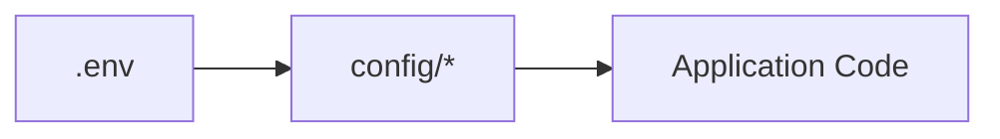
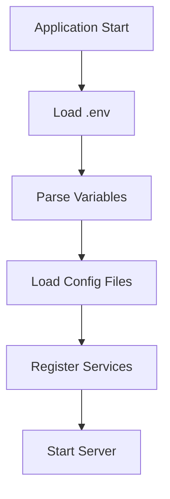
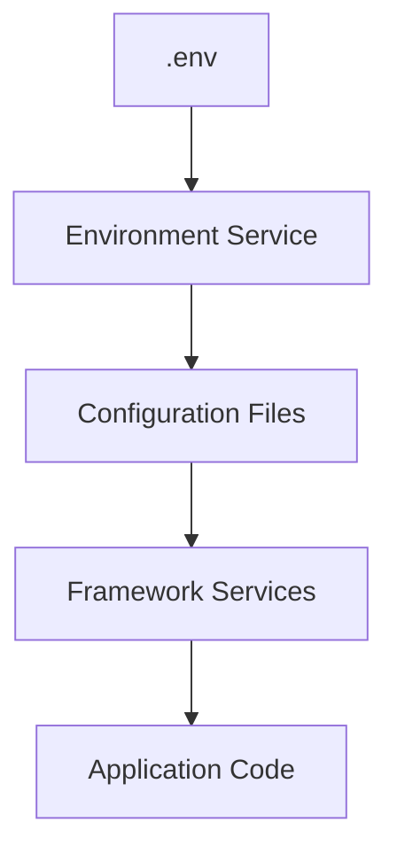

# Environment Variables

Environment variables allow your application to behave differently across development, staging, and production
environments without changing source code.

Bejibun uses environment variables to store configuration values that may vary between deployments, such as database
credentials, API keys, hostnames, and runtime settings.

This approach improves:

- Security
- Flexibility
- Portability
- Deployment workflows
- Configuration management

---

# What Are Environment Variables?

Environment variables are key-value pairs that exist outside of your application code.

Example:

```env
APP_NAME=Bejibun
APP_ENV=development
APP_HOST=127.0.0.1
APP_PORT=3000
APP_URL="http://${APP_HOST}:${APP_PORT}"
```

Your application can read these values during startup and use them throughout the framework.

---

# Why Environment Variables Matter

Without environment variables, configuration often becomes hardcoded.

Avoid:

```ts
const database = {
    host: "127.0.0.1",
    password: "secret"
};
```

Instead:

```env
DB_HOST=127.0.0.1
DB_PASSWORD=secret
```

```ts
const host = env("DB_HOST");
```

This separation allows configuration to change without modifying application code.

---

# The .env File

Bejibun loads environment variables from the project's `.env` file.

Location:

```text
.env
```

Example:

```env
APP_NAME=Bejibun
APP_ENV=development
APP_HOST=127.0.0.1
APP_PORT=3000
APP_URL="http://${APP_HOST}:${APP_PORT}"
```

This file contains environment-specific configuration for your application.

---

# Creating a .env File

Most projects provide an example file:

```text
.env.example
```

Create your environment file:

### Linux / MacOS

```bash
cp .env.example .env
```

### Windows

**Command Prompt**

```bash
copy .env.example .env
```

**Powershell**

```bash
Copy-Item .env.example .env
```

Then update the values to match your local environment.

---

# Accessing Environment Variables

Environment variables can be accessed using the environment service.

Example:

```ts
env("APP_NAME");
```

Output:

```text
Bejibun
```

This allows configuration values to be used throughout the application.

---

# Providing Default Values

You may provide a fallback value when a variable does not exist.

Example:

```ts
env("APP_PORT", 3000);
```

If:

```env
APP_PORT=8080
```

Result:

```text
8080
```

Otherwise:

```text
3000
```

This helps prevent configuration errors.

---

# Common Application Variables

Most Bejibun applications define several core variables.

---

## Application Name

```env
APP_NAME=Bejibun
```

Used for:

- Logging
- Monitoring
- Metadata
- Application identification

---

## Environment

```env
APP_ENV=development
```

Common values:

- development
- staging
- production

Environment values help the framework determine how it should behave.

---

## Application URL

```env
APP_URL=http://localhost:3000
```

Used for:

- URL generation
- Documentation links
- External integrations

---

# Database Variables

Database configuration typically uses environment variables.

Example:

```env
DB_CONNECTION=pgsql
DB_HOST=127.0.0.1
DB_PORT=5432
DB_USER=root
DB_PASSWORD=root
DB_DATABASE=app
```

These values are loaded into the database configuration during startup.

---

# MySQL Example

```env
DB_CONNECTION=mysql
DB_HOST=127.0.0.1
DB_PORT=3306
DB_USER=root
DB_PASSWORD=root
DB_DATABASE=app
```

---

# PostgreSQL Example

```env
DB_CONNECTION=pgsql
DB_HOST=127.0.0.1
DB_PORT=5432
DB_USER=root
DB_PASSWORD=root
DB_DATABASE=app
```

Choose the configuration appropriate for your environment.

---

# Redis Variables

Applications using Redis may define:

```env
REDIS_HOST=127.0.0.1
REDIS_PORT=6379
REDIS_PASSWORD=
REDIS_DATABASE=0
REDIS_MAX_RETRIES=10
REDIS_CONNECTION=local
```

These settings are used by:

- Cache
- Queues
- Rate limiting
- Realtime systems

---

# Cache Variables

Example:

```env
CACHE_DRIVER=memory
```

Possible drivers:

- local
- redis

The selected driver determines how cached data is stored.

---

# Storage Variables

Applications may configure storage behavior using environment variables.

Example:

```env
FILESYSTEM_DISK=local
```

Possible values:

- local
- public
- s3

Different environments can use different storage providers without code changes.

---

# API Keys and Third-Party Services

External integrations often require credentials.

Example:

```env
STRIPE_KEY=...

OPENAI_API_KEY=...

GITHUB_TOKEN=...
```

These values should never be committed to version control.

---

# Environment-Specific Configuration

One of the biggest advantages of environment variables is environment separation.

### Development

```env
APP_ENV=development

DB_HOST=localhost
```

### Staging

```env
APP_ENV=staging

DB_DATABASE=test_db
```

### Production

```env
APP_ENV=production

DB_HOST=production-db
```

The same application code runs everywhere.

Only configuration changes.

---

# Using Environment Variables in Configuration

Environment variables are typically referenced inside configuration files.

Example:

```ts
const config: Record<string, any> = {
    host: env("DB_HOST"),
    port: env("DB_PORT")
};

export default config;
```

This creates a clean separation:



Application code rarely needs direct access to environment variables.

---

# Environment Variable Validation

Missing variables can cause application failures.

Example:

```env
DB_PASSWORD=
```

A configuration validation system can help ensure required values exist before the application starts.

Typical validation targets:

- Database Credentials
- Redis Credentials
- API Keys
- Mail Configuration
- Storage Configuration

Failing fast prevents runtime surprises.

---

# Environment Variable Lifecycle

When the application starts:



Every service receives its configuration before handling requests.

---

# Security Best Practices

Environment variables often contain sensitive information.

Follow these recommendations.

### Never Commit .env

Add `.env` to `.gitignore`.

Good:

```gitignore
.env
```

Avoid:

```text
Git Repository
 └── .env
```

Secrets should never be stored in source control.

### Commit .env.example

Good:

```text
.env.example
```

Example:

```env
APP_NAME=

DB_HOST=

DB_DATABASE=
```

This helps other developers understand required configuration.

### Use Strong Secrets

Avoid:

```env
APP_KEY=password
```

Prefer:

```env
APP_KEY=7e4f1f0b7c...
```

### Rotate Credentials

Periodically rotate:

- API keys
- Database passwords
- Access tokens
- Service credentials

Especially after security incidents.

### Limit Access

Only authorized systems and developers should have access to production environment variables.

---

# Common Mistakes

### Hardcoding Secrets

Avoid:

```ts
const apiKey = "secret";
```

Use:

```env
API_KEY=secret
```

### Missing Variables

Always verify required values exist.

### Using Development Settings in Production

Avoid:

```env
APP_ENV=development
```

Production environments should disable debug mode.

### Sharing Real Credentials

Never publish production secrets in:

- Documentation
- Git repositories
- Issue trackers
- Screenshots

---

# Example .env File

A typical Bejibun application might contain:

```env
APP_NAME=Bejibun
APP_ENV=development
APP_HOST=localhost
APP_PORT=3000
APP_URL="http://${APP_HOST}:${APP_PORT}"

DB_HOST=127.0.0.1
DB_PORT=5432
DB_USER=root
DB_PASSWORD=root
DB_DATABASE=app

CACHE_DRIVER=local

FILESYSTEM_DISK=local

REDIS_HOST=127.0.0.1
REDIS_PORT=6379
REDIS_PASSWORD=
REDIS_DATABASE=0
REDIS_MAX_RETRIES=10
REDIS_CONNECTION=local

S3_ENDPOINT=
S3_REGION=
S3_BUCKET=
S3_ACCESS_KEY_ID=
S3_SECRET_ACCESS_KEY=
```

Your actual configuration will depend on the services your application uses.

---

# Visual Summary



Environment variables provide a secure and flexible way to configure applications across different environments.

---

# What's Next?

Now that you understand how environment variables work, continue with:

- Deployment Overview
- Request Lifecycle
- Configuration System

These guides explain how Bejibun applications are deployed, how requests flow through the framework, and how services are
managed internally.