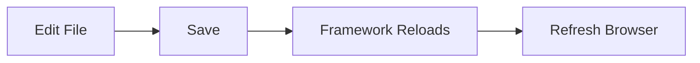

# Installation

This guide will walk you through installing Bejibun and creating your first application.

Before you begin, ensure your system meets the minimum requirements.

---

# Requirements

Bejibun is built specifically for Bun and requires a modern development environment.

## Runtime Requirements

| Software   | Version       |
| ---------- | ------------- |
| Bun        | Latest Stable |

To verify your Bun installation:

```bash
bun --version
```

Example output:

```bash
1.x.x
```

If Bun is not installed, follow the instructions below.

---

# Installing Bun

Bejibun relies on Bun as its runtime, package manager, and development toolchain.

### Linux / MacOS

Install Bun using the official installation script:

```bash
curl -fsSL https://bun.sh/install | bash
```

After installation, restart your terminal and verify:

```bash
bun --version
```

### Windows

Install Bun using PowerShell:

```powershell
powershell -c "irm bun.sh/install.ps1 | iex"
```

Verify the installation:

```powershell
bun --version
```

---

## Updating Bun

To update Bun to the latest version:

```bash
bun upgrade
```

Keeping Bun updated ensures you receive performance improvements, bug fixes, and security updates.

---

# Creating a New Application

The fastest way to start a new project is with the Bejibun CLI.

Run:

```bash
bunx @bejibun/cli my-app
```

The CLI will generate a new project structure and install the required dependencies.

Example:

```bash
✔  Pulling starter kit.
✔  Installing dependencies.
✔  Cleansing.
✔  Setup environment.

Success! Project initialization completed.
```

---

# Navigate to the Project

Move into your newly created application:

```bash
cd my-app
```

Your project directory should look similar to:

```text
📁 my-app
├── 📁 app
│   ├── controllers/
│   ├── exceptions/
│   ├── jobs/
│   ├── middlewares/
│   ├── models/
│   ├── validators/
│   └── websockets/
├── 📁 commands
├── 📁 config
├── 📁 database
│   ├── migrations/
│   └── seeders/
├── 📁 public
├── 📁 resources
├── 📁 routes
├── 📁 storage
│   ├── app/
│   ├── cache/
│   └── framework/
├── 📁 tests
├── .env
├── Dockerfile
├── ace.ts
├── bootstrap.ts
├── bunfig.toml
├── package.json
└── server.ts
```

The exact structure may vary depending on the framework version and installed packages.

---

# Environment Configuration

Most applications require environment-specific configuration.

Bejibun stores environment variables inside the `.env` file.

Example:

```env
APP_NAME=Bejibun
APP_ENV=development
APP_HOST=127.0.0.1
APP_PORT=3000
APP_URL="http://${APP_HOST}:${APP_PORT}"
```

You can customize these values as needed.

For larger applications, environment variables are commonly used to configure:

- Databases
- Cache systems
- Storage providers
- Authentication services
- External APIs

---

# Starting the Development Server

Once the project is created, start the development server:

```bash
bun dev
```

Example output:

```bash
🚀 Server running at http://127.0.0.1:3000

Local: http://localhost:3000
```

Open your browser and visit:

```text
http://localhost:3000
```

You should see your application running.

---

# Development Workflow

During development, Bejibun automatically reloads when source files change.

```bash
bun dev
```

This allows you to edit code and see changes immediately without manually restarting the server.

Typical workflow:



---

# Verifying the Installation

To confirm that everything is working correctly:

Create a simple route.

```ts
Router.get("/", () => {
    return Response.json({
        "framework": "Bejibun",
        "status": "running"
    });
});
```

Visit:

```text
http://localhost:3000
```

Expected response:

```json
{
    "framework": "Bejibun",
    "status": "running"
}
```

If you see this response, your installation is working correctly.

---

# Using the CLI

The Bejibun CLI provides generators and development utilities.

Display available commands:

```bash
bun ace
```

Example:

```bash
Usage: ace [options] [command]

Ace for your commander
Author: Havea Crenata <havea.crenata@gmail.com>

Options:
  -v, --version                Show the current version
  -h, --help                   display help for command

Commands:
  db:seed                      Run database seeders
  install <packages...>        Install package dependencies
  maintenance:down [options]   Turn app into maintenance mode
  maintenance:up               Turn app into live mode
  make:command <file>          Create a new command file
  make:controller <file>       Create a new controller file
  make:job <file>              Create a new job file
  make:middleware <file>       Create a new middleware file
  make:migration <file>        Create a new migration file
  make:model <file>            Create a new model file
  make:seeder <file>           Create a new seeder file
  make:validator <file>        Create a new validator file
  migrate:fresh [options]      Rollback all migrations and re-run migrations
  migrate:latest               Run latest migration
  migrate:rollback [options]   Rollback the latest migrations
  migrate:status [options]     List migrations status
  package:configure [options]  Configure package after installation
  queue:flush                  Flush all of the failed queue jobs
  queue:retry                  Retry a failed queue job
  queue:work                   Start processing jobs on the queue as a daemon
  help [command]               display help for command

Examples:
  $ bun ace --help
  $ bun ace --version
  $ bun ace migrate:latest
```

These commands help automate common development tasks.

---

# Creating Your First Controller

Generate a controller:

```bash
bun ace make:controller Home
```

Generated file:

```text
app/controllers/HomeController.ts
```

Example:

```ts app/controllers/HomeController.ts
import BaseController from "@bejibun/core/bases/BaseController";

export default class HomeController extends BaseController {
    public async index(request: Bun.BunRequest): Promise<Response> {
        return super.response.setData({
            message: "Hello, world!",
            method: request.method
        }).send();
    }
}
```

Register the route:

```ts
Router.get("/", "HomeController@index");
```

Visit your application to see the response.

---

# Creating Your First Model

Generate a model:

```bash
bun ace make:model User
```

Generated file:

```text
app/models/UserModel.ts
```

Example:

```ts app/models/UserModel.ts
import type {Timestamp, NullableTimestamp} from "@bejibun/core/bases/BaseModel";
import BaseModel from "@bejibun/core/bases/BaseModel";

export default class UserModel extends BaseModel {
    public static tableName: string = "users";
    public static idColumn: string = "id";

    declare id: bigint;
    declare name: string;
    declare created_at: Timestamp;
    declare updated_at: Timestamp;
    declare deleted_at: NullableTimestamp;
}
```

Models provide a convenient way to interact with database records.

---

# Running Database Migrations

If your application uses a database, run migrations after configuration.

Generate a migration:

```bash
bun ace make:migration create_users_table
```

Execute migrations:

```bash
bun ace migrate:latest
```

Successful output:

```bash
✔ Migration completed
```

Your database schema is now up to date.

---

# Production Installation

For production deployments:

Install dependencies:

```bash
bun install --production
```

Build the application if required:

```bash
bun run build
```

Start the server:

```bash
bun start
```

Production environments should also configure:

- Reverse proxies
- HTTPS
- Environment variables
- Monitoring
- Logging

Deployment topics are covered in a later section of the documentation.

---

# Troubleshooting

## Bun Command Not Found

If you receive:

```bash
bun: command not found
```

Ensure Bun is installed correctly and available in your system PATH.

Verify:

```bash
bun --version
```

---

## Port Already in Use

If the configured port is unavailable:

```bash
error: Failed to start server. Is port 3000 in use?
 syscall: "listen",
   errno: 0,
    code: "EADDRINUSE"
```

Change the port in your environment configuration:

```env
APP_PORT=4000
```

Restart the development server afterward.

---

## Dependency Installation Fails

Clear the dependency cache and reinstall:

```bash
rm -rf node_modules
rm bun.lock

bun install
```

Then start the application again.

---

# Next Steps

Congratulations! Your Bejibun environment is now ready.

Continue with:

- Creating Your First Application
- Project Structure
- Configuration

In the next guide, you'll build a complete application and learn how the framework components work together.