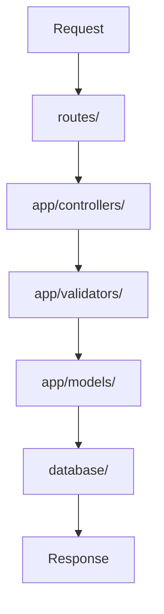

# Project Structure

Bejibun applications follow a structured and convention-driven architecture.

A predictable project structure makes applications easier to navigate, maintain, and scale as they grow.

Whether you're working alone or collaborating with a large team, knowing where code belongs helps keep your application organized.

---

# Overview

A newly created Bejibun application may look similar to:

```text
📁 Application
├── 📁 app
│   ├── controllers/
│   ├── exceptions/
│   ├── jobs/
│   ├── middlewares/
│   ├── models/
│   ├── validators/
│   └── websockets/
├── 📁 commands
├── 📁 config
├── 📁 database
│   ├── migrations/
│   └── seeders/
├── 📁 public
├── 📁 resources
├── 📁 routes
├── 📁 storage
│   ├── app/
│   ├── cache/
│   └── framework/
├── 📁 tests
├── .env
├── Dockerfile
├── ace.ts
├── bootstrap.ts
├── bunfig.toml
├── package.json
└── server.ts
```

Each directory has a specific responsibility.

---

# The app Directory

The `app` directory contains your application's core business logic.

```text
app/
├── controllers/
├── exceptions/
├── jobs/
├── middlewares/
├── models/
├── validators/
└── websockets/
```

Most of your day-to-day development will happen here.

---

## Controllers

```text
app/controllers/
```

Controllers handle incoming requests and return responses.

Example:

```ts app/controllers/UserController.ts
import BaseController from "@bejibun/core/bases/BaseController";

export default class UserController extends BaseController {
    public async index(request: Bun.BunRequest): Promise<Response> {
        //
    }
}
```

Responsibilities:

- Process requests
- Call services and models
- Return responses

Controllers should remain focused on request handling rather than complex business logic.

---

## Models

```text
app/models/
```

Models represent application data and database records.

Example:

```ts app/models/UserModel.ts
import type {Timestamp, NullableTimestamp} from "@bejibun/core/bases/BaseModel";
import BaseModel from "@bejibun/core/bases/BaseModel";

export default class UserModel extends BaseModel {
    public static tableName: string = "users";
    public static idColumn: string = "id";

    declare id: bigint;
    // ...
    declare created_at: Timestamp;
    declare updated_at: Timestamp;
    declare deleted_at: NullableTimestamp;
}
```

Responsibilities:

- Database interaction
- Relationships
- Querying
- Data representation

Models act as the bridge between your application and the database.

---

## Validators

```text
app/validators/
```

Validators define rules for incoming data.

Example:

```ts app/validators/UserValidator.ts
import type {ValidatorType} from "@bejibun/core/types/ValidatorType";
import BaseValidator from "@bejibun/core/bases/BaseValidator";

export default class UserValidator extends BaseValidator {
    public static get store(): ValidatorType {
        return super.validator.create({
            name: super.validator.string(),
            email: super.validator.string().email()
        });
    }
}
```

Responsibilities:

- Input validation
- Data sanitization
- Request verification

Validation should occur before business logic executes.

---

## Middlewares

```text
app/middlewares/
```

Middleware intercepts requests before they reach controllers.

Example:

```ts app/middlewares/AuthMiddleware.ts
import type {HandlerType} from "@bejibun/core/types";

export default class AuthMiddleware {
    public handle(handler: HandlerType): HandlerType {
        return async (request: Bun.BunRequest, server: Bun.Server<any>) => {
            // ...

            return handler(request, server);
        };
    }
}
```

Common use cases:

- Authentication
- Authorization
- Logging
- Rate limiting
- Request transformation

---

## Jobs

```text
app/jobs/
```

Jobs represent tasks that execute in the background.

Examples:

- SendEmailJob

```ts app/jobs/SendEmailJob.ts
import BaseJob from "@bejibun/core/bases/BaseJob";

export default class SendEmailJob extends BaseJob {
    /**
     * Execute the job.
     *
     * @var $arguments Array<any>
     */
    public async handle(args: Array<any>): Promise<void> {
        // ...
    }
}
```

- GenerateReportJob
- ProcessPaymentJob

Background jobs help keep HTTP requests fast and responsive.

---

## Exceptions

```text
app/exceptions/
```

This directory contains custom exceptions and exception handlers.

Example:

```ts app/exceptions/UserNotFoundException.ts
import Logger from "@bejibun/logger";
import {defineValue} from "@bejibun/utils";

export default class UserNotFoundException extends Error {
    public code: number;

    public constructor(message?: string, code?: number) {
        super(message);
        this.name = "UserNotFoundException";
        this.code = defineValue(code, 404);

        Logger.setContext(this.name).error(this.message).trace(this.stack);

        if (Error.captureStackTrace) {
            Error.captureStackTrace(this, UserNotFoundException);
        }
    }
}
```

Responsibilities:

- Error transformation
- Custom exception handling
- Domain-specific exceptions

---

## WebSockets

```text
app/websockets/
```

Contains realtime communication handlers.

Example:

```ts app/websockets/ChatWebSocket.ts
import BaseWebSocket from "@bejibun/core/bases/BaseWebSocket";

export default class ChatWebSocket extends BaseWebSocket {
    public async handle(ws: Bun.ServerWebSocket<any>, message: string | Buffer<ArrayBuffer>): Promise<void> {
        // ...
    }
}
```

These handlers manage WebSocket connections and events.

---

# The bootstrap File

```text
bootstrap.ts
```

The bootstrap file is responsible for starting the application.

Typical responsibilities include:

- Application initialization
- Service registration
- Framework bootstrapping
- Runtime setup

Most applications rarely need to modify bootstrap files.

---

# The config Directory

```text
config/
```

The configuration directory contains application settings.

Example:

```text
config/
├── cache.ts
├── command.ts
├── cors.ts
├── database.ts
├── disk.ts
├── limiter.ts
├── performance.ts
├── redis.ts
├── route.ts
├── websocket.ts
└── x402.ts
```

Configuration files control framework behavior without changing application code.

### Cache Configuration

```text
config/cache.ts
```

Configures cache drivers and cache behavior.

Example:

```ts config/cache.ts
import App from "@bejibun/app";
import CacheDriverEnum from "@bejibun/cache/enums/CacheDriverEnum";

const config: Record<string, any> = {
    default: "local",

    connections: {
        local: {
            driver: CacheDriverEnum.Local,
            path: App.Path.storagePath("cache") // absolute path
        },

        redis: {
            driver: CacheDriverEnum.Redis,
            host: Bun.env.REDIS_HOST,
            port: Bun.env.REDIS_PORT,
            password: Bun.env.REDIS_PASSWORD,
            database: Bun.env.REDIS_DATABASE
        }
    }
};

export default config;
```

### Command Configuration

```text
config/command.ts
```

Configure the locations of your command directories.

Example:

```ts config/command.ts
const config: Array<Record<string, any>> = [
    /*
    {
        path: "your-dependencies/your-directory-commands",
        path: "@bejibun/database/commands" // Example
    }
    */
];

export default config;
```

### CORS Configuration

```text
config/cors.ts
```

Controls cross-origin resource sharing behavior.

Example:

```ts config/cors.ts
const config: Record<string, any> = {
    allowedHeaders: "*",
    credentials: false,
    exposedHeaders: [],
    maxAge: 86400,
    methods: "*",
    origin: "*"
};

export default config;
```

### Database Configuration

```text
config/database.ts
```

Defines database connections and ORM behavior.

Example:

```ts config/database.ts
import type {Knex} from "knex";

const config: Knex.Config = {
    client: "pg",
    connection: {
        host: Bun.env.DB_HOST,
        port: Bun.env.DB_PORT,
        user: Bun.env.DB_USER,
        password: Bun.env.DB_PASSWORD,
        database: Bun.env.DB_DATABASE
    },
    migrations: {
        extension: "ts",
        directory: "./database/migrations",
        schemaName: "public",
        tableName: "migrations"
    },
    pool: {
        min: 0,
        max: 10
    },
    seeds: {
        extension: "ts",
        directory: "./database/seeders"
    }
};

export default config;
```

### Disk Configuration

```text
config/disk.ts
```

Configure disk connections and storage drivers.

Example:

```ts config/disk.ts
import App from "@bejibun/app";
import DiskDriverEnum from "@bejibun/core/enums/DiskDriverEnum";

const config: Record<string, any> = {
    default: "local",

    disks: {
        local: {
            driver: DiskDriverEnum.Local,
            root: App.Path.storagePath("app")
        },

        public: {
            driver: DiskDriverEnum.Local,
            root: App.Path.storagePath("app/public"),
            url: `${Bun.env.APP_URL}/storage/public`
        },

        s3: {
            driver: DiskDriverEnum.S3,
            endpoint: Bun.env.S3_ENDPOINT,
            region: Bun.env.S3_REGION,
            bucket: Bun.env.S3_BUCKET,
            access_key_id: Bun.env.S3_ACCESS_KEY_ID,
            secret_access_key: Bun.env.S3_SECRET_ACCESS_KEY,
            url: ""
        }
    }
};

export default config;
```

### Rate Limiter Configuration

```text
config/limiter.ts
```

Defines request throttling and rate-limiting rules.

Example:

```ts config/limiter.ts
const config: Record<string, any> = {
    limit: 30,
    duration: 60 // seconds
};

export default config;
```

### Performance Configuration

```text
config/performance.ts
```

Configure performance-related features and settings.

Example:

```ts config/performance.ts
const config: Record<string, any> = {
    middlewares: {
        limiter: true,
        maintenance: true
    }
};

export default config;
```

### Redis Configuration

```text
config/redis.ts
```

Defines Redis connection settings.

Example:

```ts config/redis.ts
const config: Record<string, any> = {
    default: Bun.env.REDIS_CONNECTION,

    connections: {
        local: {
            host: Bun.env.REDIS_HOST,
            port: Bun.env.REDIS_PORT,
            password: Bun.env.REDIS_PASSWORD,
            database: Bun.env.REDIS_DATABASE,
            maxRetries: Number(Bun.env.REDIS_MAX_RETRIES)
        }
    }
};

export default config;
```

### Route Configuration

```text
config/route.ts
```

Configure Swagger/OpenAPI documentation settings.

Example:

```ts config/route.ts
const config: Record<string, any> = {
    default: "swagger",

    templates: {
        swagger: {
            openapi: "3.0.0",
            components: {
                securitySchemes: {
                    ApiKeyAuth: {
                        type: "apiKey",
                        in: "header",
                        name: "x-api-key"
                    },
                    BearerAuth: {
                        type: "http",
                        scheme: "bearer"
                    }
                }
            },
            security: [
                {
                    ApiKeyAuth: []
                },
                {
                    BearerAuth: []
                }
            ],
            tags: [
                {
                    name: "Hello",
                    description: "Dummy APIs"
                },
                {
                    name: "Test",
                    description: "Example APIs"
                }
            ],
            info: {
                title: "Route List",
                description: "Bejibun Route List",
                contact: {
                    name: "API Support",
                    email: "havea@bejibun.com",
                    url: "https://bejibun.com"
                },
                license: {
                    name: "MIT",
                    url: "https://github.com/Bejibun-Framework/bejibun/blob/master/LICENSE"
                }
            },
            servers: [
                {
                    url: Bun.env.APP_URL,
                    description: `${Bun.env.APP_ENV} server`
                }
            ],
            paths: {}
        }
    }
};

export default config;
```

### WebSocket Configuration

```text
config/websocket.ts
```

Configures realtime communication settings.

Example:

```ts config/websocket.ts
const config: Record<string, any> = {
    maxPayloadLength: 1024 * 1024 * 16,

    backpressureLimit: 1024 * 1024 * 16,

    closeOnBackpressureLimit: false,

    idleTimeout: 60,

    publishToSelf: false,

    sendPings: false
};

export default config;
```

### x402 Configuration

```text
config/x402.ts
```

Configure x402 payment settings.

Example:

```ts config/x402.ts
const config = {
    version: 1,
    network: "solana-devnet",
    address: "GAnoyvy9p3QFyxikWDh9hA3fmSk2uiPLNWyQ579cckMn",
    price: "$0.01",
    timeout: 60,
    forceJson: false,
    testnet: true
};
export default config;
```

# The database Directory

```text
database/
```

Contains database-related resources.

```text
database/
├── migrations/
└── seeders/
```

### Migrations

```text
database/migrations/
```

Migrations define database schema changes.

Example:

```ts database/migrations/20260101_000001_create_users_table.ts
import type {Knex} from "knex";
import UserModel from "@/app/models/UserModel";

export function up(knex: Knex): Knex.SchemaBuilder {
    return knex.schema.createTable(UserModel.tableName, (table: Knex.TableBuilder) => {
        table.bigIncrements("id");
        table.string("name");
        table.string("email").unique();
        table.timestamps(true, true);
        table.timestamp("deleted_at");
    });
}

export function down(knex: Knex): Knex.SchemaBuilder {
    return knex.schema.dropTable(UserModel.tableName);
}
```

Responsibilities:

- Create tables
- Modify columns
- Add indexes
- Manage schema evolution

### Seeders

```text
database/seeders/
```

Seeders populate the database with initial data.

Example:

```ts database/seeders/20260101_000001_create_users_seeder.ts
import type {Knex} from "knex";
import UserModel from "@/app/models/UserModel";

export async function seed(knex: Knex): Promise<void> {
    await UserModel.query(knex).insert({
        name: "John Doe",
        email: "john.doe@example.com"
    });
}
```

Common uses:

- Development data
- Test data
- Initial application setup

---

# The routes Directory

```text
routes/
```

The routes directory defines how incoming requests are handled.

Example:

```text
routes/
├── api.ts
├── web.ts
└── websocket.ts
```

### API Routes

```text
routes/api.ts
```

Contains API endpoints.

Example:

```ts
Router.get("/users", "UserController@index");
```

Typically used for:

- REST APIs
- Mobile backends
- Third-party integrations

### Web Routes

```text
routes/web.ts
```

Contains traditional web application routes.

Example:

> 🚧 Coming soon.

### WebSocket Routes

```text
routes/websocket.ts
```

Registers realtime communication endpoints.

Example:

```ts
Router.websocket("/chat", "ChatWebSocket@handle");
```

---

# The public Directory

```text
public/
```

Contains publicly accessible assets.

Example:

```text
public/
├── apis.html
├── apis.json
├── index.css
└── index.html
```

Common contents include:

- OpenAPI documentation
- Static assets
- Public files

Everything inside this directory can be served directly to clients.

---

# The storage Directory

```text
storage/
```

Stores application-generated files.

Example:

```text
storage/
├── app/
├── cache/
└── framework/
```

Typical contents:

- Log files
- Cache files
- Uploaded files
- Generated exports

Files in storage are generally not publicly accessible.

---

# The tests Directory

```text
tests/
```

Contains automated tests.

Example:

```text
tests/
├── feature/
└── unit/
```

Responsibilities:

- Feature testing
- Unit testing
- Integration testing

A well-structured test suite improves application reliability.

---

# Environment Files

## .env

```text
.env
```

Contains environment-specific configuration.

Example:

```env
APP_NAME=Bejibun
APP_ENV=development
APP_HOST=127.0.0.1
APP_PORT=3000
APP_URL="http://${APP_HOST}:${APP_PORT}"
```

Sensitive values should always be stored in environment files rather than committed to source code.

---

# package.json

```text
package.json
```

Defines project metadata, scripts, and dependencies.

Example:

```json
{
    "name": "my-app"
}
```

Common responsibilities:

- Dependency management
- Script definitions
- Package metadata

---

# tsconfig.json

```text
tsconfig.json
```

Configures TypeScript compilation behavior.

Example:

```json
{
    "compilerOptions": {}
}
```

This file controls:

- Type checking
- Module resolution
- Path aliases
- Build settings

---

# bunfig.toml

```text
bunfig.toml
```

Configures Bun-specific behavior.

Example:

```toml
[test]
preload = ["./tests/setup.ts"]
```

Used for:

- Runtime configuration
- Testing configuration
- Bun-specific settings

---

# How Everything Works Together

A typical request flows through multiple directories:



Each component has a focused responsibility.

---

# Recommended Organization

As your application grows, keep code organized by responsibility.

Good:

```text
app/
├── controllers/
├── middlewares/
├── models/
├── jobs/
└── validators/
```

Avoid placing unrelated code into the same directory.

Clear organization improves maintainability.

---

# Visual Summary

```text
Application
│
├── app/            → Business Logic
├── config/         → Configuration
├── database/       → Migrations & Seeders
├── public/         → Public Assets
├── routes/         → Route Definitions
├── storage/        → Generated Files
├── tests/          → Automated Tests
│
├── .env
├── bootstrap.ts    → Application Startup
├── package.json
├── tsconfig.json
└── bunfig.toml
```

Understanding the project structure is the first step toward building maintainable Bejibun applications.

---

# What's Next?

Now that you're familiar with the application structure, continue with:

- Configuration
- Environment Variables
- Deployment Overview

These guides explain how to configure your application and prepare it for deployment.