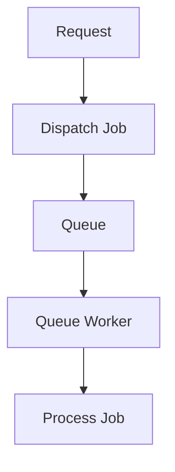
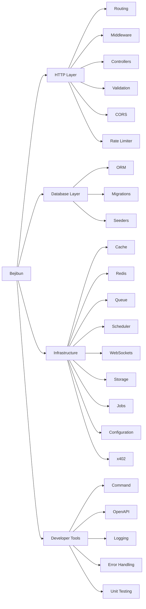

# Feature Overview

Bejibun is a full-stack backend framework designed to provide everything needed to build modern applications on Bun.

Rather than forcing developers to assemble dozens of third-party packages, Bejibun offers a cohesive ecosystem of tools
that work together using consistent conventions and architecture.

This page provides a high-level overview of the framework's major capabilities.

---

# Designed for Modern Development

Building production applications requires much more than HTTP routing.

A typical application needs:

- Routing
- Validation
- Database Access
- Caching
- Redis
- Background Jobs
- WebSockets
- Logging
- API Documentation
- Authentication
- Storage
- Rate Limiting

Bejibun provides a growing collection of integrated solutions that address these common requirements.

---

# Routing

The routing system defines how incoming requests are mapped to application logic.

Example:

```ts
Router.get("/", () => {
    return Response.json({
        message: "Hello World"
    });
});
```

Features include:

- HTTP routes
- Route parameters
- Route groups
- Route prefixes
- Route middleware
- Resource routes
- API routes
- WebSocket routes
- x402 Payments

Routing serves as the foundation of every Bejibun application.

---

# Controllers

Controllers organize request handling into dedicated classes.

Example:

```ts
export default class UserController extends BaseController {
    public async index(request: Bun.BunRequest): Promise<Response> {
        //
    }
}
```

Benefits:

- Cleaner route definitions
- Better organization
- Easier testing
- Reusable logic

Controllers help separate application behavior from route declarations.

---

# Middleware

Middleware allows developers to intercept requests before they reach controllers.

Common use cases include:

- Authentication
- Authorization
- Logging
- Rate limiting
- Request transformation
- Security checks

Example:

```ts
Router.middleware(new AuthMiddleware()).get("/profile", handler);
```

Middleware creates a flexible request processing pipeline.

---

# Validation

Validation ensures incoming data meets application requirements before business logic is executed.

Example:

```ts
export default class UserValidator extends BaseValidator {
    public static get createUser(): ValidatorType {
        return super.validator.create({
            name: super.validator.string(),
            email: super.validator.string().email()
        });
    }
}
```

Benefits:

- Safer applications
- Better user feedback
- Reduced runtime errors
- Consistent request validation

Validation is a critical part of API development.

---

# Database ORM

Bejibun includes an ORM for working with application data using models and queries.

Example:

```ts
const users = await User.all();
```

Capabilities include:

- Models
- Relationships
- Query building
- Pagination
- Scopes
- Soft deletes
- Transactions

The ORM simplifies database interactions while maintaining flexibility.

---

# Database Migrations

Migrations allow database schemas to evolve alongside application code.

Example:

```ts
export function up(knex: Knex): Knex.SchemaBuilder {
    //
}

export function down(knex: Knex): Knex.SchemaBuilder {
    //
}
```

Benefits:

- Version-controlled schemas
- Team collaboration
- Consistent deployments
- Automated database updates

---

# Database Seeders

Seeders populate databases with sample or initial data.

Example:

```ts
export async function seed(knex: Knex): Promise<void> {
    //
}
```

Seeders are useful for:

- Local development
- Automated testing
- Initial application setup

---

# Caching

Caching reduces database and API load by storing frequently accessed data.

Example:

```ts
await Cache.add("users", users);
```

Benefits:

- Faster responses
- Reduced server load
- Improved scalability

Applications can dramatically improve performance through strategic caching.

---

# Redis Integration

Redis provides high-performance in-memory storage.

Common use cases:

- Caching
- Session storage
- Rate limiting
- Queue processing
- Realtime systems

Example:

```ts
await Redis.set("online-users", 100);
```

Redis enables many advanced application features.

---

# WebSockets

WebSockets enable realtime communication between clients and servers.

Common applications:

- Chat systems
- Notifications
- Live dashboards
- Multiplayer experiences
- Collaborative applications

Example:

```ts
Router.websocket("/", "ChatWebSocket@handle");
```

```ts
export default class ChatWebSocket extends BaseWebSocket {
    public async handle(ws: Bun.ServerWebSocket<any>, message: string | Buffer<ArrayBuffer>): Promise<void> {
        //
    }
}
```

Bejibun includes first-class support for realtime applications.

---

# Background Jobs

Some tasks should not run during an HTTP request.

Examples:

- Sending emails
- Processing files
- Generating reports
- Calling external APIs

Jobs move long-running work into background workers.



This improves application responsiveness and scalability.

---

# Queue Processing

Queues manage background task execution.

Benefits:

- Better performance
- Improved reliability
- Controlled concurrency
- Retry mechanisms

Queue systems are essential for large-scale applications.

---

# Storage

The storage system provides a unified interface for managing files.

Common use cases:

- User uploads
- Images
- Documents
- Generated exports

Example:

```ts
await Storage.put("avatars/user.png", file);
```

Storage drivers can be configured to support different environments.

---

# OpenAPI Integration

Bejibun includes support for API documentation generation.

Benefits:

- Interactive documentation
- API exploration
- Team collaboration
- Third-party integrations

Example outputs:

- OpenAPI Specification
- Swagger UI
- API Explorer

Maintaining API documentation becomes significantly easier.

---

# Logging

Logging records important application events.

Example:

```ts
Logger.info("User authenticated");
```

Logs help teams:

- Debug issues
- Monitor systems
- Audit activity
- Investigate incidents

Logging is a core part of operating applications in production.

---

# Error Handling

Bejibun provides centralized exception handling.

Example:

```ts
throw new Error("Something went wrong");
```

```ts app/exceptions/handler.ts
import ExceptionHandler from "@bejibun/core/exceptions/ExceptionHandler";

export default class Handler extends ExceptionHandler {
    public handle(error: any): globalThis.Response {
        //

        return super.handle(error);
    }
}
```

The framework automatically:

- Captures exceptions
- Logs errors
- Generates responses
- Protects sensitive information

This ensures predictable application behavior.

---

# Rate Limiting

Rate limiting protects applications from abuse and excessive traffic.

Example:

```ts config/limiter.ts
const config: Record<string, any> = {
    limit: 30,
    duration: 60 // seconds
};

export default config;
```

Benefits:

- Abuse prevention
- Resource protection
- Improved reliability
- Fair usage enforcement

---

# CORS Management

Cross-Origin Resource Sharing (CORS) controls how external clients interact with APIs.

Example configuration:

```ts config/cors.ts
const config: Record<string, any> = {
    allowedHeaders: "*",
    credentials: false,
    exposedHeaders: [],
    maxAge: 86400,
    methods: "*",
    origin: "*"
};

export default config;
```

This helps secure browser-based applications and API integrations.

---

# Configuration Management

Configuration is centralized and environment-aware.

Example:

```ts
config("database.default");
```

Applications can safely manage:

- Database settings
- Cache settings
- Service credentials
- Application behavior

without hardcoding values.

---

# CLI Tooling

Bejibun includes a command-line interface for common development tasks.

Typical commands include:

```bash
bun ace make:controller
bun ace make:model
bun ace migrate:latest
bun ace db:seed
```

CLI tooling improves productivity and standardizes workflows.

---

# x402 Payments

Bejibun includes support for x402-powered payment flows.

This enables developers to create:

- Paid APIs
- Monetized endpoints
- Usage-based services
- Machine-to-machine payments

without relying solely on traditional payment gateways.

---

# Production Ready

Bejibun includes the tools required to run applications in production environments.

Key capabilities include:

- Logging
- Error handling
- Caching
- Redis integration
- Queue processing
- Rate limiting
- OpenAPI documentation
- Environment configuration

These features help applications remain reliable as they scale.

---

# Extensible Ecosystem

Bejibun is designed to be extended.

Developers can create:

- Custom middleware
- Custom validators
- Custom commands
- Custom services
- Custom packages

The framework provides strong defaults while remaining flexible.

---

# At a Glance



Together, these features provide a complete foundation for building modern applications on Bun.

---

# Next Steps

Now that you have an overview of Bejibun's capabilities, continue with:

- Release Cycle
- Installation
- Creating Your First Application

These guides will help you understand the framework's release strategy and begin building your first Bejibun application.