# Release Cycle

Bejibun follows a predictable release cycle designed to balance stability, innovation, and long-term maintainability.

A clear release strategy helps developers confidently build and maintain applications while adopting new features at
a sustainable pace.

This page explains how Bejibun versions are released, supported, and upgraded.

---

# Versioning

Bejibun follows **Semantic Versioning (SemVer)**.

Version numbers use the format:

```text
vMAJOR.MINOR.PATCH
```

Example:

```text
v1.4.2
```

Each segment communicates the type of changes included in a release.

---

## Major Releases

Major releases introduce breaking changes.

Example:

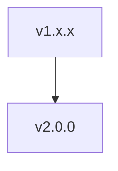

Breaking changes may include:

- API redesigns
- Framework architecture changes
- Removed features
- Updated conventions
- Dependency changes

Major releases may require application updates before upgrading.

Example:

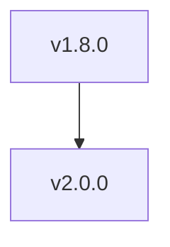

Developers should review the upgrade guide before adopting a new major version.

---

## Minor Releases

Minor releases introduce new functionality without breaking existing applications.

Example:

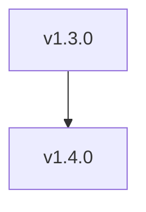

Typical additions include:

- New framework features
- New commands
- New integrations
- Developer experience improvements
- Performance enhancements

Applications should generally be able to upgrade safely.

---

## Patch Releases

Patch releases contain bug fixes and small improvements.

Example:

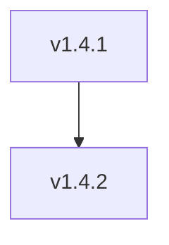

Patch releases typically include:

- Bug fixes
- Security fixes
- Stability improvements
- Documentation updates

No breaking changes should occur in patch releases.

---

# Release Types

Bejibun publishes several types of releases throughout its lifecycle.

---

## Stable Releases

Stable releases are recommended for production environments.

Characteristics:

- Fully tested
- Documented
- Supported
- Suitable for production use

Example:

```text
v1.5.0
```

Production applications should primarily use stable releases.

---

## Pre-Releases

Pre-releases allow developers to test upcoming features before they become stable.

Examples:

```text
v2.0.0-alpha.1

v2.0.0-beta.1

v2.0.0-rc.1
```

These releases help the community:

- Test new functionality
- Identify bugs
- Provide feedback
- Validate upgrade paths

Pre-releases should not be considered production-ready unless explicitly stated.

---

# Release Stages

New features typically move through several stages before becoming stable.

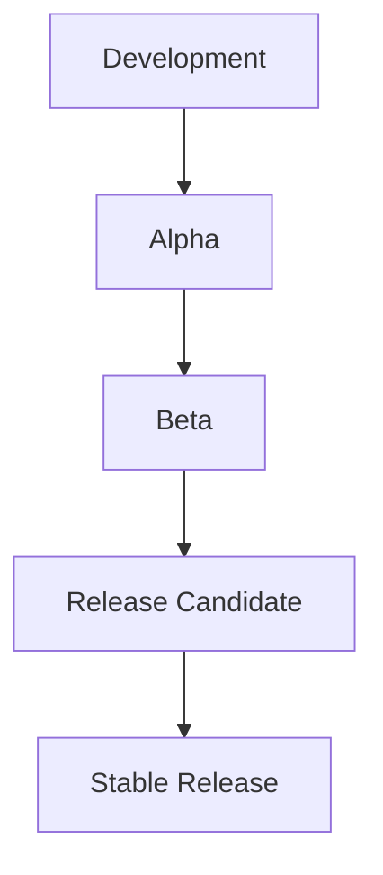

This process helps ensure quality and reliability.

---

## Alpha

Alpha releases contain early implementations.

Characteristics:

- Experimental
- Rapidly changing
- Incomplete features
- Not production ready

Purpose:

- Validate Ideas
- Gather Feedback
- Test Architecture

---

## Beta

Beta releases are feature-complete but still undergoing testing.

Characteristics:

- Most functionality implemented
- Potential bugs remain
- API changes still possible

Purpose:

- Community Testing
- Performance Validation
- Compatibility Checks

---

## Release Candidate (RC)

Release candidates are nearly complete.

Characteristics:

- Feature complete
- Stability focused
- Bug fixes only

Purpose:

- Final Validation
- Upgrade Testing
- Production Evaluation

If no major issues are discovered, the release candidate becomes the stable release.

---

# Support Policy

Each major release receives active support for a defined period.

Support typically includes:

- Bug fixes
- Security updates
- Critical stability improvements

Example lifecycle:

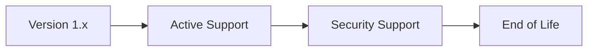

Support periods may evolve as the framework matures.

Always review release notes for the most current support information.

---

# Long-Term Stability

One of Bejibun's goals is to minimize unnecessary breaking changes.

The framework aims to provide:

- Stable APIs
- Predictable upgrades
- Gradual evolution
- Backward compatibility whenever possible

Breaking changes are introduced only when they provide meaningful long-term improvements.

---

# Upgrade Philosophy

Framework upgrades should be manageable.

Bejibun follows several principles when introducing changes:

### Minimize Breaking Changes

Existing applications should continue working whenever possible.

### Document Every Breaking Change

Major releases include detailed upgrade documentation.

### Provide Migration Paths

Developers should understand how to transition from older APIs.

### Prioritize Stability

New features should not compromise existing applications.

---

# Security Updates

Security vulnerabilities are treated with high priority.

Security-related releases may be published outside the normal release schedule.

Example:

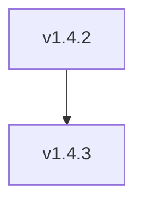

These updates should be applied as soon as possible.

---

# Deprecation Policy

Features may occasionally be deprecated before removal.

Example:

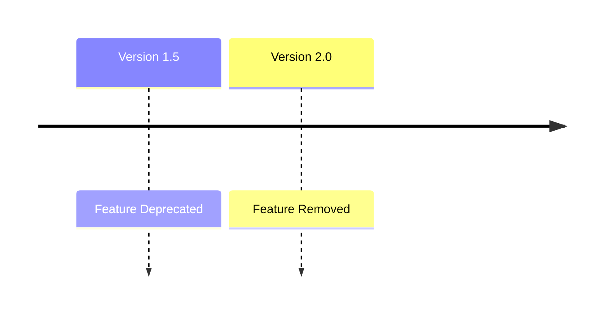

This process gives developers time to update applications before breaking changes occur.

Typical deprecation workflow:

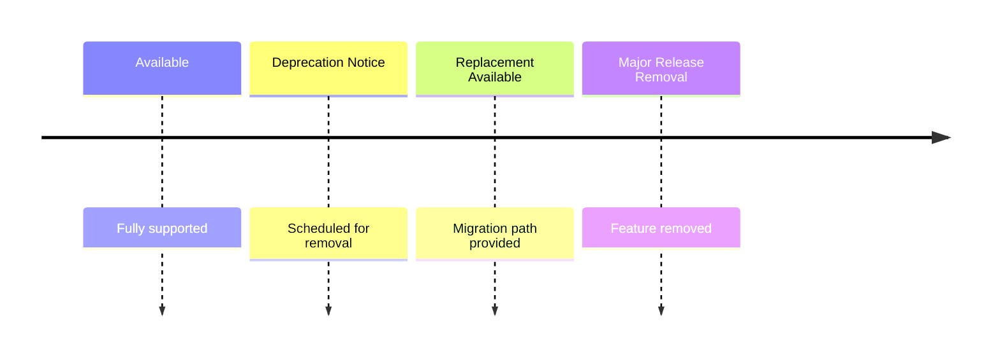

---

# Release Notes

Every release should include release notes describing:

- New features
- Bug fixes
- Performance improvements
- Security updates
- Breaking changes
- Migration instructions

Example:

```text
v1.5.0

Added:
- WebSocket channels
- New cache driver

Improved:
- Route performance

Fixed:
- Redis connection issue
```

Reviewing release notes before upgrading is strongly recommended.

---

# Recommended Upgrade Strategy

For most applications:

### Patch Releases

Upgrade immediately.

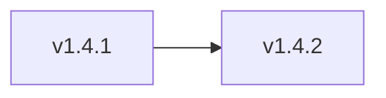

---

### Minor Releases

Upgrade regularly after testing.

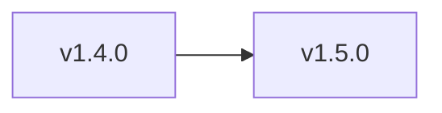

---

### Major Releases

Review upgrade guides before upgrading.

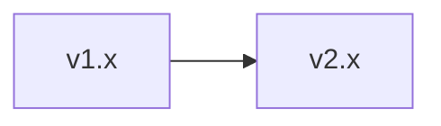

Major releases may require code changes.

---

# Staying Up to Date

To keep applications healthy:

```text
✔ Review Release Notes

✔ Apply Security Updates

✔ Monitor Deprecation Notices

✔ Test Upgrades Early

✔ Follow Upgrade Guides
```

Regular maintenance is significantly easier than large, infrequent upgrades.

---

# Version Compatibility

Applications should generally follow these guidelines:

| Version Type  | Expected Compatibility        |
|---------------|-------------------------------|
| Patch         | Fully compatible              |
| Minor         | Backward compatible           |
| Major         | May contain breaking changes  |

This predictable model allows teams to plan upgrades confidently.

---

# Framework Evolution

Bejibun is continuously evolving.

Future releases may introduce:

- New framework capabilities
- Improved developer tooling
- Performance optimizations
- Additional integrations
- Ecosystem packages

While the framework grows, its core philosophy remains unchanged:

- Developer Experience
- Type Safety
- Performance
- Consistency
- Maintainability

These principles guide every release.

---

# Visual Summary

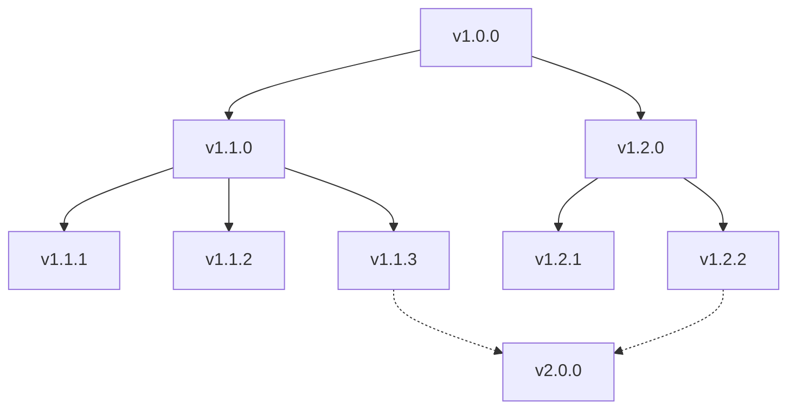

This structure allows the framework to evolve while maintaining stability for existing applications.

---

# Next Steps

Now that you understand how Bejibun releases are versioned and maintained, you're ready to start building.

Continue with:

- Installation
- Creating Your First Application
- Project Structure

These guides will help you set up your first Bejibun application and become familiar with the framework's architecture.