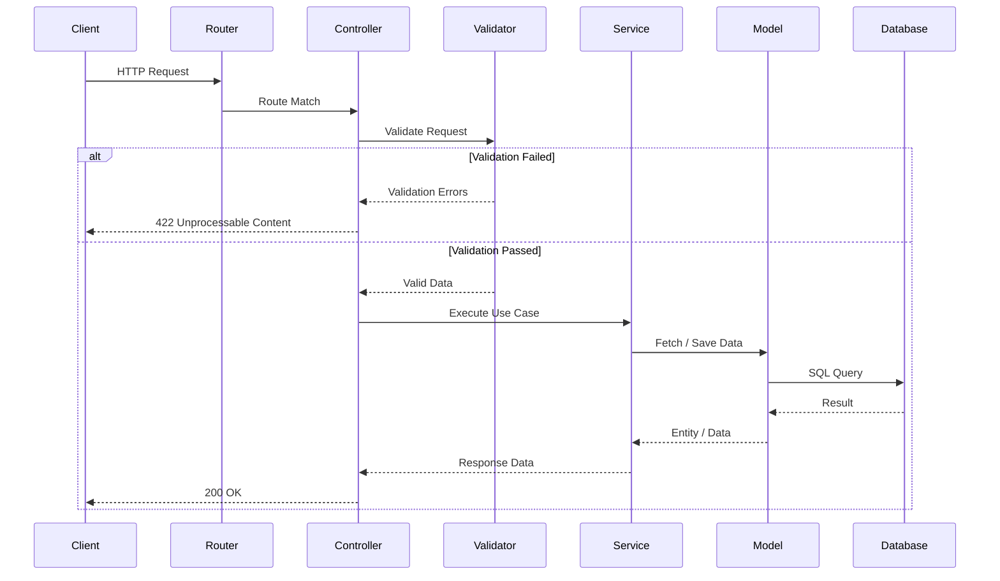

# What is Bejibun?

Bejibun is a modern, batteries-included TypeScript framework built specifically for the Bun runtime.

Inspired by the developer experience of frameworks like Laravel, Bejibun provides a structured and productive environment
for building APIs, web applications, real-time systems, and backend services without sacrificing performance or type safety.

Rather than assembling dozens of libraries and configurations before writing application logic, Bejibun provides
a unified ecosystem with sensible defaults and first-class integrations.

---

## Built for Bun

Bejibun is designed from the ground up for Bun.

By embracing Bun as its foundation, Bejibun benefits from:

- Fast startup times
- High-performance HTTP handling
- Native TypeScript support
- Modern JavaScript APIs
- Built-in tooling
- Simplified deployment

Developers can focus on building applications instead of managing runtime complexity.

---

## Laravel-Inspired Developer Experience

Bejibun adopts many of the concepts developers love about Laravel while embracing TypeScript and Bun.

Examples include:

- MVC architecture
- Dependency injection
- Service providers
- Middleware
- Validation
- Configuration management
- Database migrations
- Queue jobs
- Event-driven architecture

The goal is familiar productivity without bringing PHP-specific limitations into the TypeScript ecosystem.

---

## TypeScript First

TypeScript is not an afterthought.

Every part of the framework is designed with type safety in mind.

Benefits include:

- Better autocomplete
- Improved refactoring
- Compile-time validation
- Safer application architecture
- Enhanced developer experience

This allows teams to build large applications with greater confidence and maintainability.

---

## Batteries Included

Modern applications require more than a router.

Bejibun includes a growing ecosystem of integrated features that work together out of the box.

Current framework capabilities include:

- Installation CLI
- Ace as CLI command
- Routing
- Middleware
- Controller
- Validation
- Command
- Database ORM
- Migrations
- Seeders
- Cache
- Redis
- WebSockets
- OpenAPI integration
- Logging
- Exception handling
- Queue jobs
- Scheduler
- Rate limiting
- File storage
- CORS
- Unit testing
- x402 payments

Instead of spending time evaluating and integrating multiple packages, developers can rely on a consistent framework experience.

---

## MVC Architecture

Bejibun follows the Model-View-Controller (MVC) pattern.



This architecture encourages:

- Separation of concerns
- Maintainable codebases
- Clear application structure
- Scalable team collaboration

Whether you're building a small API or a large enterprise platform, MVC provides a familiar and organized foundation.

---

## Designed for Modern Applications

Bejibun is built to support a wide range of application types.

Examples include:

### REST APIs

Build secure and scalable APIs with routing, validation, middleware, and OpenAPI support.

### Real-Time Applications

Use WebSockets for chat systems, notifications, dashboards, and collaborative experiences.

### SaaS Platforms

Leverage authentication, authorization, queues, storage, and database tooling to build production-ready software.

### AI and Agent Backends

Create APIs and services that power AI applications, automation workflows, and agent-based systems.

### Payment-Enabled APIs

Integrate monetized endpoints using built-in x402 support.

---

## A Unified Developer Experience

One of Bejibun's primary goals is consistency.

Instead of learning separate conventions for routing, validation, database access, caching, and background processing,
developers interact with a cohesive framework designed around shared principles.

```text
📁 Application
├── 📁 app
│   ├── controllers/
│   ├── exceptions/
│   ├── jobs/
│   ├── middlewares/
│   ├── models/
│   ├── validators/
│   └── websockets/
├── 📁 commands
├── 📁 config
├── 📁 database
│   ├── migrations/
│   └── seeders/
├── 📁 public
├── 📁 resources
├── 📁 routes
├── 📁 storage
│   ├── app/
│   ├── cache/
│   └── framework/
├── 📁 tests
├── .env
├── Dockerfile
├── ace.ts
├── bootstrap.ts
├── bunfig.toml
├── package.json
└── server.ts
```

This consistency reduces cognitive overhead and helps teams move faster.

---

## Open and Extensible

While Bejibun provides many features out of the box, it is also designed to be extensible.

Developers can:

- Create custom middleware
- Build custom commands
- Extend validation rules
- Add startup codes
- Develop reusable packages
- Integrate external services

The framework aims to provide strong defaults without limiting customization.

---

## Who Is Bejibun For?

Bejibun is suitable for:

- Individual developers
- Startup teams
- SaaS companies
- API developers
- Enterprise applications
- Open-source projects

Whether you're building your first API or managing a large production system, Bejibun provides the tools needed to develop efficiently.

---

## Why Was Bejibun Created?

Modern TypeScript development often requires assembling multiple libraries before a project becomes productive.

A typical setup might involve:

```text
Router
ORM
Validation
Dependency Injection
Configuration
Queue System
Documentation
WebSockets
Caching
```

Each library introduces its own APIs, conventions, and maintenance requirements.

Bejibun was created to provide a unified framework experience where these components work together seamlessly from the start.

---

## The Vision

Bejibun aims to become the most productive framework for building modern backend applications on Bun.

Its vision is centered around:

- Developer productivity
- Excellent developer experience
- Performance by default
- Type safety
- Extensibility
- Long-term maintainability

By combining Bun's speed with a cohesive application architecture, Bejibun helps developers focus on building products
rather than configuring infrastructure.

---

## Next Steps

Now that you understand what Bejibun is, continue with:

- Why Bejibun?
- Framework Philosophy
- Feature Overview

These guides explain the design decisions, principles, and capabilities that shape the framework.