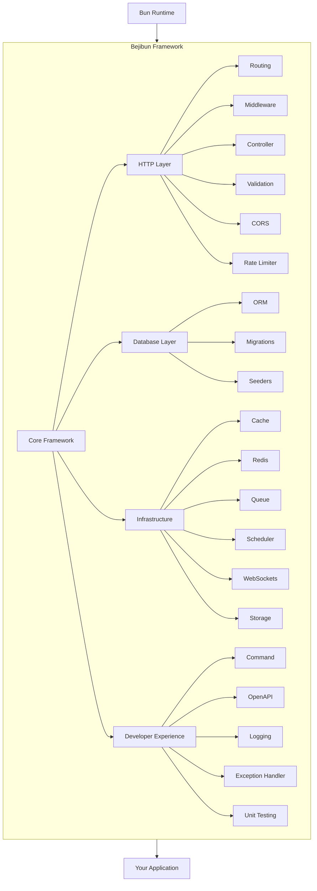

# Why Bejibun?

Building backend applications in TypeScript has never been easier--but it often comes with a hidden cost.

Many projects begin by selecting a runtime, then a router, an ORM, a validation library, a dependency injection container,
a documentation generator, a cache layer, a queue system, and countless supporting packages.

While this flexibility is powerful, it can also lead to fragmented architectures, inconsistent patterns, and unnecessary complexity.

Bejibun was created to provide a cohesive development experience where the most common backend requirements work together
from the start.

---

## The Modern TypeScript Problem

A typical backend project often begins like this:

```text
Runtime
 ├── Router
 ├── ORM
 ├── Validation
 ├── Authentication
 ├── Cache
 ├── Redis
 ├── OpenAPI
 ├── WebSockets
 ├── Queue System
 └── Logging
```

Each tool may have:

- Different conventions
- Different configuration styles
- Different release cycles
- Different documentation
- Different maintenance requirements

As applications grow, managing integrations becomes increasingly difficult.

---

## One Framework, One Experience

Bejibun provides a unified ecosystem.

Instead of assembling unrelated libraries, developers work within a framework designed around consistent patterns.

```text
📁 Application
├── 📁 app
│   ├── controllers/
│   ├── exceptions/
│   ├── jobs/
│   ├── middlewares/
│   ├── models/
│   ├── validators/
│   └── websockets/
├── 📁 commands
├── 📁 config
├── 📁 database
│   ├── migrations/
│   └── seeders/
├── 📁 public
├── 📁 resources
├── 📁 routes
├── 📁 storage
│   ├── app/
│   ├── cache/
│   └── framework/
├── 📁 tests
├── .env
├── Dockerfile
├── ace.ts
├── bootstrap.ts
├── bunfig.toml
├── package.json
└── server.ts
```

Every component follows the same architectural principles.

This consistency reduces cognitive overhead and helps teams move faster.

---

## Built Specifically for Bun

Many frameworks support Bun as an alternative runtime.

Bejibun takes a different approach.

It is designed specifically for Bun from the beginning.

Benefits include:

- Faster startup times
- Optimized runtime performance
- Native TypeScript support
- Simpler tooling
- Reduced dependency overhead

Instead of adapting an existing ecosystem to Bun, Bejibun embraces Bun as its foundation.

---

## Productivity Without Sacrificing Structure

Rapid development should not come at the expense of maintainability.

Bejibun encourages organized application architecture through:

- MVC patterns
- Dependency injection
- Centralized configuration
- Modular configuration
- Clear project structure

This allows applications to remain maintainable as they scale.

---

## TypeScript First

Type safety is a core part of the developer experience.

With Bejibun, TypeScript is integrated throughout the framework rather than layered on afterward.

Benefits include:

- Strong typing
- Better IDE support
- Safer refactoring
- Earlier error detection
- Improved maintainability

Large codebases become easier to manage when contracts are enforced by the compiler.

---

## Batteries Included

Modern applications require more than routing.

Bejibun includes many commonly needed capabilities out of the box.

```text
Framework
├── Routing
├── Controllers
├── Validation
├── Middleware
├── ORM
├── Migrations
├── Seeders
├── Cache
├── Redis
├── WebSockets
├── OpenAPI
├── Logging
├── Queue
├── Scheduler
├── Unit testing
└── Storage
```

Developers spend less time integrating infrastructure and more time building products.

---

## Consistent Application Architecture

One of the most common problems in large projects is inconsistency.

Different developers may structure code differently, making maintenance difficult.

Bejibun provides conventions that encourage predictable organization.

```text
app/
├── controllers/
├── exceptions/
├── jobs/
├── middlewares/
├── models/
├── validators/
└── websockets/
```

A consistent structure makes applications easier to understand, onboard, and maintain.

---

## Developer Experience Matters

Performance is important, but developer experience is equally valuable.

Bejibun focuses on making common tasks straightforward.

Examples include:

- Creating routes
- Building controllers
- Defining validation rules
- Managing database migrations
- Generating API documentation
- Working with WebSockets
- Integrating caching

The framework aims to minimize boilerplate and maximize productivity.

---

## Built for Modern APIs

Most modern applications rely heavily on APIs.

Bejibun includes features designed for API development:

- Request validation
- OpenAPI generation
- Middleware pipelines
- Authentication support
- Rate limiting
- Structured error handling

These capabilities help teams build reliable APIs faster.

---

## Real-Time Ready

Many applications require real-time communication.

Examples include:

- Chat systems
- Live dashboards
- Notifications
- Collaborative applications
- Monitoring platforms

Bejibun includes WebSocket support as part of the framework ecosystem, reducing the need for external solutions.

---

## Production-Oriented

Building an application is only the beginning.

Operating it reliably in production is equally important.

Bejibun includes tools and patterns that support production workloads:

- Logging
- Error handling
- Redis integration
- Caching
- Rate limiting
- Queue processing
- Configuration management

These features help applications remain stable as usage grows.

---

## Extensible by Design

No framework can predict every use case.

Bejibun is designed to be extended when necessary.

Developers can:

- Create custom middleware
- Build reusable packages
- Extend validation behavior
- Add custom commands
- Integrate external systems

The framework provides strong defaults while remaining flexible.

---

## Familiar, Yet Modern

Bejibun borrows proven ideas from established frameworks while embracing modern TypeScript development.

Developers coming from frameworks such as:

- Laravel
- AdonisJS
- NestJS
- Express
- Fastify

Will find many familiar concepts while benefiting from Bun's modern runtime capabilities.

---

## Why Teams Choose Bejibun

Teams often adopt Bejibun because they want:

### Less Configuration

Spend less time wiring libraries together.

### Faster Development

Focus on application logic rather than infrastructure setup.

### Consistent Architecture

Maintain predictable project structures across teams.

### Modern Performance

Leverage Bun's speed without sacrificing developer experience.

### Long-Term Maintainability

Build applications that remain manageable as they grow.

---

## Bejibun at a Glance



The framework handles the common infrastructure concerns so developers can focus on delivering value.

---

## Next Steps

Now that you understand why Bejibun exists and the problems it aims to solve, continue with:

- Framework Philosophy
- Feature Overview
- Release Cycle

These guides explain the principles behind the framework and help you start building your first application.