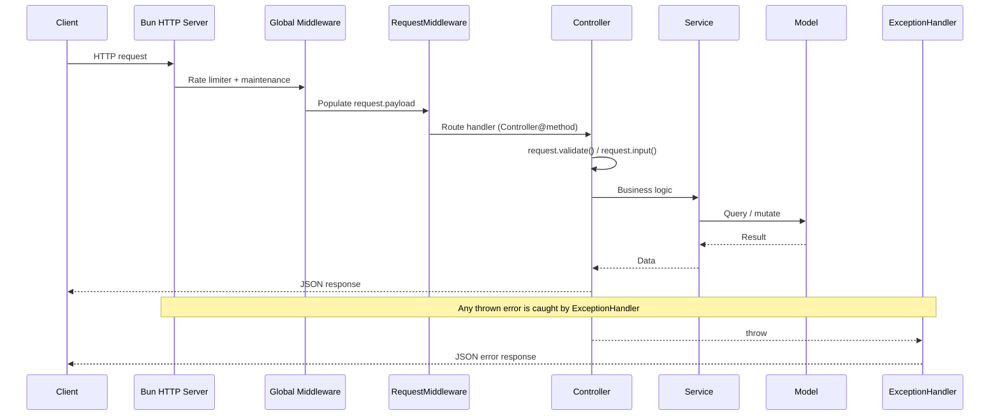

Every HTTP request follows a fixed path through the framework before a response is returned. Knowing the order of these
stages tells you where to place logic, how to debug, and why errors come back in a consistent shape.

## Lifecycle at a glance



## 1. Request arrival

The cycle begins when a client (browser, mobile app, or another service) sends an HTTP request:

```http
POST /users HTTP/1.1
Host: example.com
Content-Type: application/json
```

Bun's HTTP server accepts the request and starts dispatching it.

## 2. Application bootstrap

Bootstrap runs once at startup, before any request is handled. `server.ts` imports `bootstrap.ts`, which loads the
database, decorators, WebSocket handlers, namespaces, and CORS configuration. The server then builds its route map,
generates the OpenAPI spec (`public/apis.json`), and assembles the global middleware stack.

Because this happens once, per-request work is limited to matching a route and running its handler.

## 3. Route resolution

Bun matches the request against the serialized route map produced from `routes/api.ts` and `routes/web.ts`. A route is
declared with a path and a `"Controller@method"` handler:

```ts routes/api.ts
Router.get("/users/:id", "UserController@show");
```

`/users/1` resolves to `UserController@show` with the path parameter `{ id: "1" }`. If no route matches, the request
falls through to `ExceptionHandler.publicRoute`, which serves a matching static file from `public/` or returns a `404`.

## 4. Middleware

Before a handler runs, the request passes through the global middleware stack, assembled in `server.ts`:

```ts
Router.middleware(...middlewares)
    .middleware(new RequestMiddleware())
    .group([apiRoutes, Router.serialize(webRoutes)]);
```

`middlewares` contains the optional built-ins enabled in `config/performance.ts` (`limiter` and `maintenance`). The
first middleware listed is the outermost -- it runs first on the way in and last on the way out.

`RequestMiddleware` runs next and populates `request.payload` from the incoming request, so every handler can rely on it.
Values merge in this order (later sources win on collision):

1. Parsed JSON body (`application/json`)
2. Route parameters (`request.params`)
3. URL query string
4. Form data (`multipart/form-data` or `application/x-www-form-urlencoded`), including uploaded `File`s
5. Raw body text under `payload.plainText`

You can add your own middleware with a `handle()` method that wraps the next handler:

```ts app/middlewares/AuthMiddleware.ts
import type {HandlerType} from "@bejibun/core/types";

export default class AuthMiddleware {
    public handle(handler: HandlerType): HandlerType {
        return async (request: Bejibun.Request, server: Bun.Server<any>) => {
            if (!request.bearerToken()) {
                return Response.setMessage("Unauthorized").setStatus(401).send();
            }

            return handler(request, server);
        };
    }
}
```

Register it per route or per group:

```ts
Router.middleware(new AuthMiddleware()).group([Router.get("/profile", "ProfileController@show")]);
```

When middleware returns early, the controller never runs.

## 5. Controller & validation

The resolved controller method receives a `Bejibun.Request`. Controllers extend `BaseController`, which exposes the
fluent `super.response` facade. Validate input with `request.validate()`, then read values with `request.input()`:

```ts app/controllers/UserController.ts
import BaseController from "@bejibun/core/bases/BaseController";
import UserModel from "@/app/models/UserModel";
import UserValidator from "@/app/validators/UserValidator";

export default class UserController extends BaseController {
    public async store(request: Bejibun.Request): Promise<Response> {
        await request.validate(UserValidator.store);

        const user = await UserModel.create({
            name: request.input("name"),
            email: request.input("email")
        });

        return super.response.setData(user).setStatus(201).send();
    }
}
```

`request.validate()` returns the validated data and throws a `ValidatorException` (mapped to `422`) on failure.
`request.input("name")` reads a single field; `request.input()` with no key returns the whole payload.

## 6. Service & model

Keep controllers thin by delegating business logic to a service, which talks to models:

```ts app/services/UserService.ts
import UserModel from "@/app/models/UserModel";

export default class UserService {
    public static async create(data: Record<string, any>) {
        return UserModel.create(data);
    }
}
```

Models (extending `BaseModel`) abstract database access into TypeScript classes. Lookups like
`UserModel.findOrFail(id)` throw a `ModelNotFoundException` (mapped to `404`) when no row matches.

## 7. Response

Controllers return a response built with the `Response` facade, which wraps the payload in a standard envelope:

```ts
return super.response.setData(user).send();
```

```json
{
    "data": {
        "id": 1,
        "name": "John Doe",
        "email": "john@example.com",
        "created_at": "2026-01-01T15:00:00.000Z",
        "updated_at": "2026-01-01T15:00:00.000Z"
    },
    "message": "Success",
    "status": 200
}
```

The facade also supports `setMessage`, `setStatus`, `setCustom`, `setCookie`/`setCookies`, `deleteCookie`/`deleteCookies`,
and `stream` for file responses.

## 8. Exception handling

An error thrown anywhere in the cycle -- a middleware rejection, a failed validation, or a database error -- is caught by
the exception handler configured in `Bun.serve`. Framework exceptions carry their own status code and message; anything
else becomes a generic `500` response:

```json
{
    "data": null,
    "message": "No query results for model [UserModel] [999].",
    "status": 404
}
```

See [Error Handling](/v0.6/guides/core-concepts/error-handling) for the full mapping.

## Next steps

- [Logging](/v0.6/guides/core-concepts/logging) -- the logger used throughout the pipeline
- [Configuration System](/v0.6/guides/getting-started/configuration) -- the files that drive bootstrap and middleware
- [Error Handling](/v0.6/guides/core-concepts/error-handling) -- how exceptions become responses
