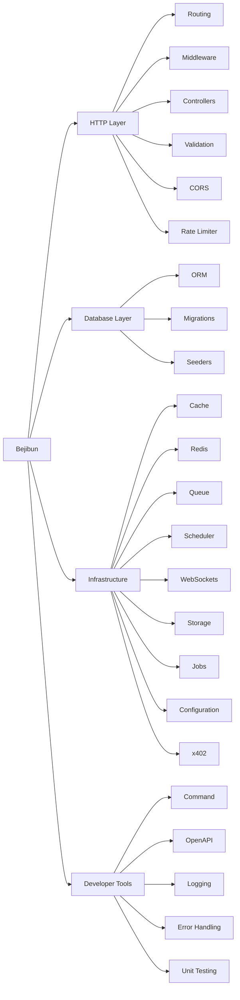

Bejibun is a full-stack backend framework designed to provide everything needed to build modern applications on Bun. Rather than forcing developers to assemble dozens of third-party packages, it offers a cohesive ecosystem of tools that work together using consistent conventions and architecture.

## Designed for Modern Development

Building production applications requires more than HTTP routing. A typical application needs routing, validation, database access, caching, Redis, background jobs, WebSockets, logging, API documentation, authentication, storage, and rate limiting. Bejibun provides a growing collection of integrated solutions that address these requirements.

## Routing

The routing system defines how incoming requests are mapped to application logic.

```ts
Router.get("/", () => {
    return Response.json({
        message: "Hello World"
    });
});
```

Features include HTTP routes, route parameters, route groups, route prefixes, route middleware, resource routes, API routes, WebSocket routes, and x402 payments. Routing serves as the foundation of every Bejibun application.

## Controllers

Controllers organize request handling into dedicated classes. Controllers receive a `Bejibun.Request` -- an extension of `Bun.BunRequest` with a populated `payload` and 36 request helpers.

```ts app/controllers/UserController.ts
import BaseController from "@bejibun/core/bases/BaseController";

export default class UserController extends BaseController {
    public async index(request: Bejibun.Request): Promise<Response> {
        const page = request.input("page", 1);

        return super.response.setData({page}).send();
    }
}
```

<Tip>
    Read request data with `request.input(key?, fallback?)` and validate it with
    `request.validate(validator)`. The global `RequestMiddleware` populates `request.payload`,
    merging JSON body, route params, query string, and form data.
</Tip>

Controllers keep route declarations clean, improve organization, and make logic easier to test and reuse.

## Middleware

Middleware intercepts requests before they reach controllers. Common use cases include authentication, authorization, logging, rate limiting, request transformation, and security checks.

```ts
Router.middleware(new AuthMiddleware()).get("/profile", handler);
```

Middleware creates a flexible request processing pipeline.

## Validation

Validation ensures incoming data meets application requirements before business logic executes.

```ts app/validators/UserValidator.ts
import BaseValidator from "@bejibun/core/bases/BaseValidator";

export default class UserValidator extends BaseValidator {
    public static get createUser(): Bejibun.Validator {
        return super.validator.create({
            name: super.validator.string(),
            email: super.validator.string().email()
        });
    }
}
```

Validators extend `BaseValidator` and build schemas with the shared `super.validator` (VineJS) instance. Custom `exists` and `unique` rules are available on number and string schemas. Call `request.validate(UserValidator.createUser)` in a controller to validate and type-coerce incoming data; it throws a `ValidatorException` (HTTP 422) on failure.

## Database ORM

Bejibun includes an ORM for working with application data using models and queries.

```ts
const users = await User.all();
```

Capabilities include models, relationships, query building, pagination, scopes, soft deletes, and transactions.

## Database Migrations

Migrations allow database schemas to evolve alongside application code.

```ts
export function up(knex: Knex): Knex.SchemaBuilder {
    return knex.schema.createTable("tests", (table) => {
        table.bigIncrements("id");
        table.timestamps(true, true);
    });
}

export function down(knex: Knex): Knex.SchemaBuilder {
    return knex.schema.dropTable("tests");
}
```

Migrations provide version-controlled schemas, team collaboration, consistent deployments, and automated database updates.

## Database Seeders

Seeders populate databases with sample or initial data, useful for local development, automated testing, and initial application setup.

```ts
export async function seed(knex: Knex): Promise<void> {
    // insert seed data
}
```

## Caching

Caching reduces database and API load by storing frequently accessed data, yielding faster responses, reduced server load, and improved scalability.

```ts
await Cache.add("users", users);
```

## Redis Integration

Redis provides high-performance in-memory storage for caching, session storage, rate limiting, queue processing, and realtime systems.

```ts
await Redis.set("online-users", 100);
```

## WebSockets

WebSockets enable realtime communication for chat systems, notifications, live dashboards, multiplayer experiences, and collaborative applications.

```ts routes/websocket.ts
Router.websocket("/", "ChatWebSocket@handle");
```

```ts app/websockets/ChatWebSocket.ts
export default class ChatWebSocket extends BaseWebSocket {
    public async handle(
        ws: Bun.ServerWebSocket<any>,
        message: string | Buffer<ArrayBuffer>
    ): Promise<void> {
        // handle incoming message
    }
}
```

## Background Jobs

Some tasks -- sending emails, processing files, generating reports, or calling external APIs -- should not run during an HTTP request. Jobs move long-running work into background workers, improving application responsiveness and scalability.

Generate a job and implement `handle()`:

```ts app/jobs/ExportReportJob.ts
import BaseJob from "@bejibun/core/bases/BaseJob";

export default class ExportReportJob extends BaseJob {
    public async handle(args: Array<any>): Promise<void> {
        // long-running work, e.g. export and store a report
    }
}
```

Dispatch it from anywhere with `dispatch(...).send()`:

```ts
await ExportReportJob.dispatch({reportId: 42}).send();
```

## Queue Processing

Queues manage background task execution, providing better performance, improved reliability, controlled concurrency, and retry mechanisms. Bejibun's queue runs on the database driver via `config/queue.ts`.

Run workers from the CLI:

```bash
bun ace queue:work    # process jobs as a long-running daemon
bun ace queue:retry   # retry a failed job
bun ace queue:flush   # flush all failed jobs
```

See [Queues & Jobs](/v0.6/guides/background/queues) for the full workflow and [Task Scheduling](/v0.6/guides/background/scheduler) to run commands on a recurring schedule.

## Storage

The storage system provides a unified interface for managing files. As of v0.6.0 it ships as the standalone [`@bejibun/storage`](/v0.6/guides/storage/file-storage) package rather than being built into `@bejibun/core`.

```ts
await Storage.put("avatars/user.png", file);
```

Install it with `bun ace install @bejibun/storage` and configure disks in `config/storage.ts`. Storage drivers can be configured to support different environments.

## OpenAPI Integration

Bejibun supports API documentation generation, producing OpenAPI Specifications, Swagger UI, and an API explorer for interactive documentation, API exploration, team collaboration, and third-party integrations.

## Logging

Logging records important application events.

```ts
Logger.info("User authenticated");
```

Logs help debug issues, monitor systems, audit activity, and investigate incidents.

## Error Handling

Bejibun provides centralized exception handling.

```ts app/exceptions/handler.ts
import ExceptionHandler from "@bejibun/core/exceptions/ExceptionHandler";

export default class Handler extends ExceptionHandler {
    public handle(error: any): globalThis.Response {
        return super.handle(error);
    }
}
```

The framework automatically captures exceptions, logs errors, generates responses, and protects sensitive information.

## Rate Limiting

Rate limiting protects applications from abuse and excessive traffic.

```ts config/limiter.ts
const config: Record<string, any> = {
    limit: 30,
    duration: 60 // seconds
};

export default config;
```

Rate limiting provides abuse prevention, resource protection, improved reliability, and fair usage enforcement.

## CORS Management

Cross-Origin Resource Sharing (CORS) controls how external clients interact with APIs.

```ts config/cors.ts
const config: Record<string, any> = {
    allowedHeaders: "*",
    credentials: false,
    exposedHeaders: [],
    maxAge: 86400,
    methods: "*",
    origin: "*"
};

export default config;
```

## Configuration Management

Configuration is centralized and environment-aware. The global `config()` helper reads from `config/<file>.ts`, and `env()` wraps `Bun.env`.

```ts
config("database.connections.pgsql.host");
config("cache.default");
env("APP_KEY", "fallback");
```

## CLI Tooling

Bejibun includes a command-line interface for common development tasks.

```bash
bun ace make:controller
bun ace make:model
bun ace make:migration
bun ace migrate:latest
bun ace db:seed
bun ace route:list
```

## x402 Payments

Bejibun includes support for x402-powered payment flows, enabling paid APIs, monetized endpoints, usage-based services, and machine-to-machine payments. Register payment-protected routes with `Router.x402(...)`.

## Production Ready

Bejibun includes the tools required to run applications in production, including logging, error handling, caching, Redis integration, queue processing, rate limiting, OpenAPI documentation, and environment configuration.

## Extensible Ecosystem

Bejibun is designed to be extended. Developers can create custom middleware, custom validators, custom commands, custom services, and custom packages. The framework provides strong defaults while remaining flexible.

## At a Glance



## Next Steps

Continue with [Release Cycle](/v0.6/guides/introduction/release-cycle), [Installation](/v0.6/guides/getting-started/installation), and [Creating Your First Application](/v0.6/guides/getting-started/creating-your-first-application) to understand the release strategy and begin building.
