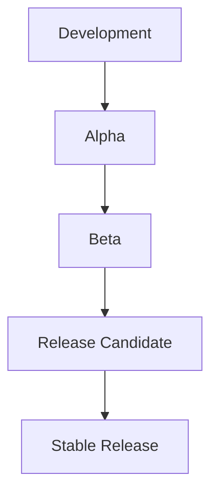
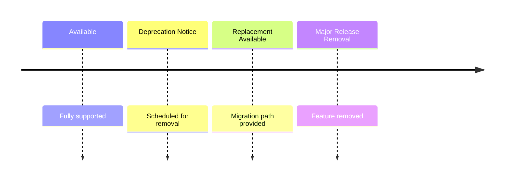

Bejibun follows a predictable release cycle designed to balance stability, innovation, and long-term maintainability. This page explains how versions are released, supported, and upgraded.

## Versioning

Bejibun follows **Semantic Versioning (SemVer)**. Version numbers use the format `vMAJOR.MINOR.PATCH` -- for example `v1.4.2` -- where each segment communicates the type of changes included in a release.

### Major Releases

Major releases introduce breaking changes and may require application updates before upgrading. Breaking changes may include API redesigns, framework architecture changes, removed features, updated conventions, or dependency changes. Review the upgrade guide before adopting a new major version.

### Minor Releases

Minor releases introduce new functionality without breaking existing applications. Typical additions include new framework features, new commands, new integrations, developer experience improvements, and performance enhancements. Applications should generally upgrade safely.

### Patch Releases

Patch releases contain bug fixes, security fixes, stability improvements, and documentation updates. No breaking changes should occur in patch releases.

## Release Types

Bejibun publishes several types of releases throughout its lifecycle.

### Stable Releases

Stable releases -- for example `v1.5.0` -- are recommended for production environments. They are fully tested, documented, supported, and suitable for production use.

### Pre-Releases

Pre-releases allow developers to test upcoming features before they become stable. Examples include `v2.0.0-alpha.1`, `v2.0.0-beta.1`, and `v2.0.0-rc.1`. They help the community test new functionality, identify bugs, provide feedback, and validate upgrade paths. Pre-releases are not considered production-ready unless explicitly stated.

## Release Stages

New features move through several stages before becoming stable.



### Alpha

Alpha releases contain early, experimental implementations that change rapidly and may have incomplete features. They validate ideas, gather feedback, and test architecture.

### Beta

Beta releases are feature-complete but still undergoing testing. Most functionality is implemented, but potential bugs remain and API changes are still possible. They serve community testing, performance validation, and compatibility checks.

### Release Candidate (RC)

Release candidates are feature-complete and stability-focused, receiving bug fixes only. They provide final validation, upgrade testing, and production evaluation. If no major issues are discovered, the release candidate becomes the stable release.

## Support Policy

Each major release receives active support for a defined period, typically including bug fixes, security updates, and critical stability improvements. Support periods may evolve as the framework matures -- always review release notes for the most current support information.

## Long-Term Stability

Bejibun minimizes unnecessary breaking changes. The framework aims to provide stable APIs, predictable upgrades, gradual evolution, and backward compatibility whenever possible. Breaking changes are introduced only when they provide meaningful long-term improvements.

## Upgrade Philosophy

Framework upgrades should be manageable. Bejibun follows several principles when introducing changes:

- **Minimize breaking changes** -- existing applications should continue working whenever possible.
- **Document every breaking change** -- major releases include detailed upgrade documentation.
- **Provide migration paths** -- developers should understand how to transition from older APIs.
- **Prioritize stability** -- new features should not compromise existing applications.

## Security Updates

Security vulnerabilities are treated with high priority. Security-related releases may be published outside the normal release schedule and should be applied as soon as possible.

## Deprecation Policy

Features may be deprecated before removal.



This process gives developers time to update applications before breaking changes occur.

## Release Notes

Every release should include release notes describing new features, bug fixes, performance improvements, security updates, breaking changes, and migration instructions. Reviewing release notes before upgrading is strongly recommended.

```text
v1.5.0

Added:
- WebSocket channels
- New cache driver

Improved:
- Route performance

Fixed:
- Redis connection issue
```

## Recommended Upgrade Strategy

- **Patch releases** -- upgrade immediately.
- **Minor releases** -- upgrade regularly after testing.
- **Major releases** -- review upgrade guides before upgrading; they may require code changes.

## Version Compatibility

| Version Type | Expected Compatibility       |
| ------------ | ---------------------------- |
| Patch        | Fully compatible             |
| Minor        | Backward compatible          |
| Major        | May contain breaking changes |

## Staying Up to Date

To keep applications healthy, review release notes, apply security updates, monitor deprecation notices, test upgrades early, and follow upgrade guides. Regular maintenance is significantly easier than large, infrequent upgrades.

## Framework Evolution

Bejibun is continuously evolving. Future releases may introduce new framework capabilities, improved developer tooling, performance optimizations, additional integrations, and ecosystem packages. While the framework grows, its core philosophy -- developer experience, type safety, performance, consistency, and maintainability -- remains unchanged.

## Next Steps

Continue with [Installation](/v0.6/guides/getting-started/installation), [Creating Your First Application](/v0.6/guides/getting-started/creating-your-first-application), and [Project Structure](/v0.6/guides/getting-started/project-structure) to set up your first Bejibun application.
