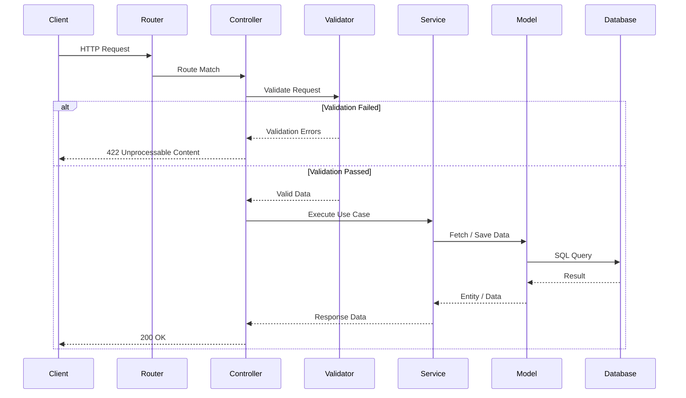

Bejibun is a modern, batteries-included TypeScript framework built specifically for the Bun runtime. Inspired by the developer experience of Laravel, it provides a structured, productive environment for building APIs, web applications, real-time systems, and backend services without sacrificing performance or type safety.

Rather than assembling dozens of libraries and configuration files before writing application logic, Bejibun ships a unified ecosystem with sensible defaults and first-class integrations.

## Built for Bun

Bejibun is designed from the ground up for Bun and inherits its runtime characteristics:

- Fast startup times
- High-performance HTTP handling
- Native TypeScript support
- Modern JavaScript APIs
- Built-in tooling
- Simplified deployment

## Laravel-Inspired Developer Experience

Bejibun adopts concepts developers value in Laravel while embracing TypeScript and Bun:

- MVC architecture
- Dependency injection
- Service providers
- Middleware
- Validation
- Configuration management
- Database migrations
- Queue jobs
- Event-driven architecture

The goal is familiar productivity without carrying PHP-specific limitations into the TypeScript ecosystem.

## TypeScript First

TypeScript is not an afterthought. Every part of the framework is designed for type safety, yielding better autocomplete, improved refactoring, compile-time validation, and safer application architecture.

## Batteries Included

Bejibun includes an integrated ecosystem of features that work together out of the box:

- Installation CLI
- Ace CLI
- Routing
- Middleware
- Controllers
- Validation
- Commands
- Database ORM
- Migrations
- Seeders
- Cache
- Redis
- WebSockets
- OpenAPI integration
- Logging
- Exception handling
- Queue jobs
- Scheduler
- Rate limiting
- File storage
- CORS
- Unit testing
- x402 payments

## MVC Architecture

Bejibun follows the Model-View-Controller (MVC) pattern.



This architecture encourages separation of concerns, maintainable codebases, clear application structure, and scalable team collaboration.

## Designed for Modern Applications

Bejibun supports a range of application types:

### REST APIs

Build secure, scalable APIs with routing, validation, middleware, and OpenAPI support.

### Real-Time Applications

Use WebSockets for chat systems, notifications, dashboards, and collaborative experiences.

### SaaS Platforms

Leverage authentication, authorization, queues, storage, and database tooling to build production-ready software.

### AI and Agent Backends

Create APIs and services that power AI applications, automation workflows, and agent-based systems.

### Payment-Enabled APIs

Integrate monetized endpoints using built-in x402 support.

## A Unified Developer Experience

Consistency is a primary goal. Instead of learning separate conventions for routing, validation, database access, caching, and background processing, developers interact with a cohesive framework built on shared principles.

```text
📁 Application
├── 📁 app
│   ├── 📁 controllers
│   ├── 📁 exceptions
│   ├── 📁 jobs
│   ├── 📁 middlewares
│   ├── 📁 models
│   ├── 📁 validators
│   └── 📁 websockets
├── 📁 commands
├── 📁 config
├── 📁 database
│   ├── 📁 migrations
│   └── 📁 seeders
├── 📁 public
├── 📁 resources
├── 📁 routes
├── 📁 storage
│   ├── 📁 app
│   ├── 📁 cache
│   └── 📁 framework
├── 📁 tests
├── .dockerignore
├── .env
├── .env.example
├── .gitignore
├── .prettierignore
├── .prettierrc.json
├── ace.ts
├── bootstrap.ts
├── bun.lock
├── bun-env.d.ts
├── bunfig.toml
├── Dockerfile
├── eslint.config.js
├── package.json
├── server.ts
└── tsconfig.json
```

## Open and Extensible

Bejibun provides strong defaults without limiting customization. Developers can create custom middleware, build custom commands, extend validation rules, add startup code, develop reusable packages, and integrate external services.

## Who Is Bejibun For?

Bejibun suits individual developers, startup teams, SaaS companies, API developers, enterprise applications, and open-source projects.

## Why Was Bejibun Created?

Modern TypeScript development often requires assembling many libraries before a project becomes productive. A typical setup combines a router, ORM, validation library, dependency injection container, configuration system, queue, documentation generator, WebSockets, and caching -- each with its own APIs, conventions, and maintenance burden. Bejibun was created to provide a unified framework where these components work together from the start.

## The Vision

Bejibun aims to be the most productive framework for building backend applications on Bun. Its vision centers on developer productivity, excellent developer experience, performance by default, type safety, extensibility, and long-term maintainability.

## Next Steps

Continue with [Why Bejibun?](/v0.6/guides/introduction/why-bejibun), [Framework Philosophy](/v0.6/guides/introduction/framework-philosophy), and [Feature Overview](/v0.6/guides/introduction/feature-overview) to understand the design decisions, principles, and capabilities that shape the framework.
