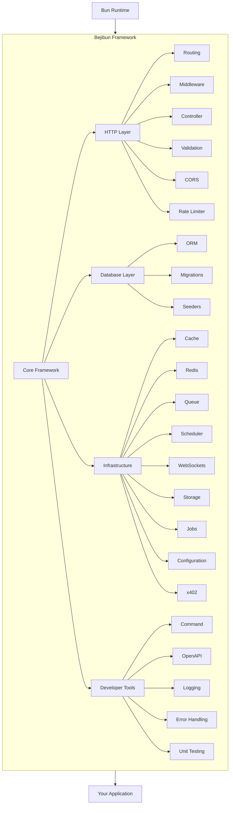

Building backend applications in TypeScript often comes with a hidden cost. Many projects begin by selecting a runtime, then a router, an ORM, a validation library, a dependency injection container, a documentation generator, a cache layer, a queue system, and countless supporting packages. This flexibility is powerful, but it can lead to fragmented architectures, inconsistent patterns, and unnecessary complexity.

Bejibun provides a cohesive development experience where the most common backend requirements work together from the start.

## The Modern TypeScript Problem

A typical backend project begins like this:

```text
Runtime
 ├── Router
 ├── ORM
 ├── Validation
 ├── Authentication
 ├── Cache
 ├── Redis
 ├── OpenAPI
 ├── WebSockets
 ├── Queue System
 └── Logging
```

Each tool brings its own conventions, configuration style, release cycle, documentation, and maintenance requirements. As applications grow, managing these integrations becomes increasingly difficult.

## One Framework, One Experience

Bejibun provides a unified ecosystem where every component follows the same architectural principles. Instead of assembling unrelated libraries, developers work within a framework designed around consistent patterns -- reducing cognitive overhead.

## Built Specifically for Bun

Many frameworks support Bun as an alternative runtime. Bejibun is designed specifically for Bun from the beginning, rather than adapting an existing ecosystem to it:

- Faster startup times
- Optimized runtime performance
- Native TypeScript support
- Simpler tooling
- Reduced dependency overhead

## Productivity Without Sacrificing Structure

Rapid development should not come at the expense of maintainability. Bejibun encourages organized application architecture through MVC patterns, dependency injection, centralized and modular configuration, and a clear project structure.

## TypeScript First

Type safety is a core part of the developer experience. TypeScript is integrated throughout the framework rather than layered on afterward, delivering strong typing, better IDE support, safer refactoring, earlier error detection, and improved maintainability.

## Batteries Included

Bejibun includes many commonly needed capabilities out of the box:

```text
Framework
├── Routing
├── Controllers
├── Validation
├── Middleware
├── ORM
├── Migrations
├── Seeders
├── Cache
├── Redis
├── WebSockets
├── OpenAPI
├── Logging
├── Queue
├── Scheduler
├── Unit testing
└── Storage
```

## Consistent Application Architecture

Inconsistency is one of the most common problems in large projects. Bejibun provides conventions that encourage predictable organization, so `app/` always contains `controllers/`, `exceptions/`, `jobs/`, `middlewares/`, `models/`, `validators/`, and `websockets/`. A consistent structure makes applications easier to understand, onboard, and maintain.

## Developer Experience Matters

Performance is important, but developer experience is equally valuable. Bejibun minimizes boilerplate for common tasks such as creating routes, building controllers, defining validation rules, managing database migrations, generating API documentation, working with WebSockets, and integrating caching.

## Built for Modern APIs

Most modern applications rely heavily on APIs. Bejibun includes features designed for API development: request validation, OpenAPI generation, middleware pipelines, authentication support, rate limiting, and structured error handling.

## Real-Time Ready

Bejibun includes WebSocket support as part of the framework ecosystem, reducing the need for external solutions for chat systems, live dashboards, notifications, collaborative applications, and monitoring platforms.

## Production-Oriented

Building an application is only the beginning; operating it reliably in production is equally important. Bejibun includes logging, error handling, Redis integration, caching, rate limiting, queue processing, and configuration management to support production workloads.

## Extensible by Design

No framework can predict every use case. Bejibun is designed to be extended: developers can create custom middleware, build reusable packages, extend validation behavior, add custom commands, and integrate external systems.

## Familiar, Yet Modern

Bejibun borrows proven ideas from established frameworks while embracing modern TypeScript development. Developers coming from Laravel, AdonisJS, NestJS, Express, or Fastify will find familiar concepts alongside Bun's modern runtime capabilities.

## Why Teams Choose Bejibun

- **Less configuration** -- spend less time wiring libraries together.
- **Faster development** -- focus on application logic rather than infrastructure setup.
- **Consistent architecture** -- maintain predictable project structures across teams.
- **Modern performance** -- leverage Bun's speed without sacrificing developer experience.
- **Long-term maintainability** -- build applications that remain manageable as they grow.

## Bejibun at a Glance



The framework handles the common infrastructure concerns so developers can focus on delivering value.

## Next Steps

Continue with [Framework Philosophy](/v0.6/guides/introduction/framework-philosophy), [Feature Overview](/v0.6/guides/introduction/feature-overview), and [Release Cycle](/v0.6/guides/introduction/release-cycle) to understand the principles behind the framework and begin building your first application.
